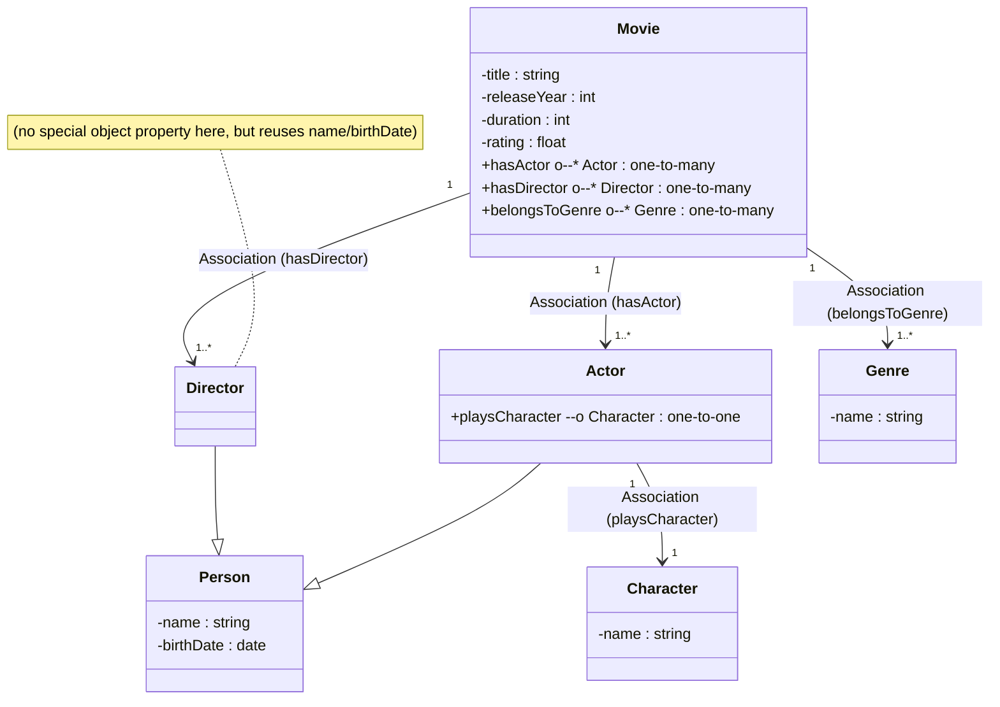
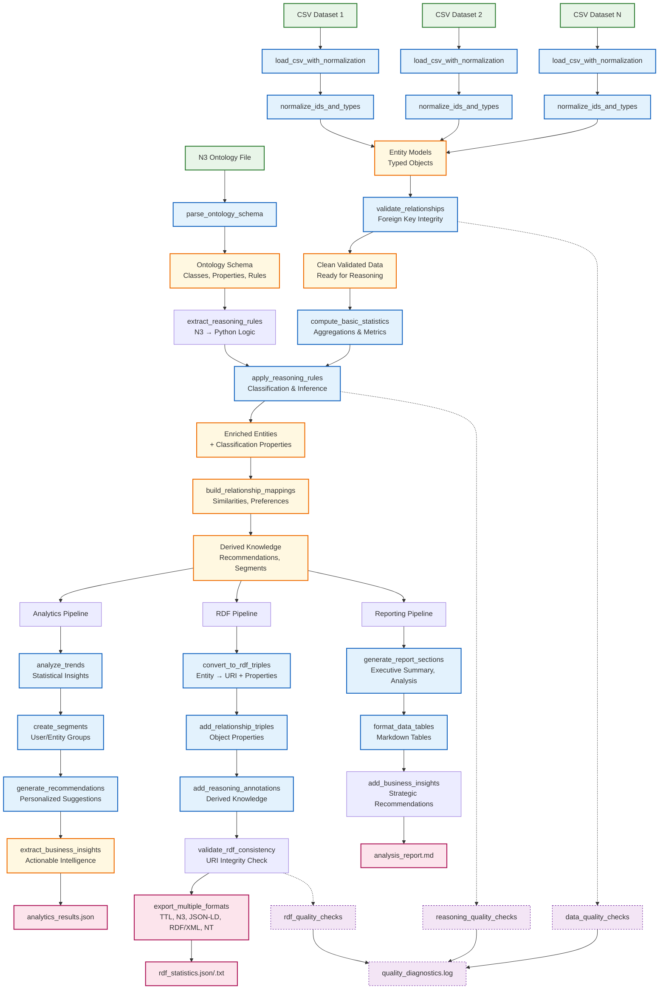
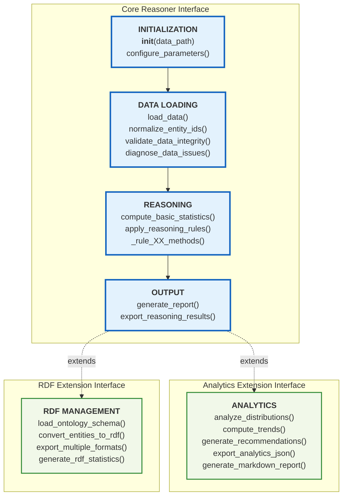

# Ontology #1: Movie Domain    
     
## Thought Framework for Building Ontologies
     
### General Methodology for Building Ontologies

1. **Define the Purpose and Scope**    
   - What do we want to capture about the domain?    
   - Who will use this ontology and for what tasks?

2. **Identify Core Concepts and Relationships**    
   - Brainstorm key entities.    
   - Decide how these entities relate to each other.

3. **Organize Hierarchies (Taxonomies) and Properties**    
   - Group similar concepts in hierarchies.    
   - Identify attributes (data properties) for each concept.    
   - Identify relationships (object properties) among concepts.

4. **Iterate and Refine**    
   - Create a first pass.    
   - Check for missing concepts, properties, or inconsistencies.    
   - Repeat until the ontology is stable enough to use.

5. **Validate with Sample Data**    
   - Create or collect sample data.    
   - Check if the ontology can capture the data properly.    
   - Adjust if needed.

6. **Document**    
   - Use a standard structure (e.g., RDF/OWL notations in practice).    
   - Make your ontology discoverable and understandable.

---
### A simple way to start    

**One way** to think of an ontology is in terms of everyday language constructs:

1. **Nouns → Classes / Entities**    
   These are the “things” in your domain (e.g., Movie, Actor, Director).    

2. **Verbs → Relationships / Object Properties**    
   These describe how nouns relate to each other (e.g., “Movie *has* Actor,” “Actor *portrays* Character,” “Movie *won* Award”).    

3. **Adjectives / Adverbs → Data Properties**    
   These describe or qualify our nouns or relationships (e.g., a Movie’s `title`, `releaseYear`, `rating`; an Actor’s `name`, `birthDate`; an Award’s `name`, `year`).    

Using this mental model helps keep things structured:    
- **Nouns (Classes)** are your domain’s main building blocks.    
- **Verbs (Relations)** connect your domain’s main building blocks.    
- **Adjectives (Data Properties)** give us descriptive detail about those blocks or relationships.    

--- 

## Creating Ontology #1: Movie Domain
    
#### Purpose & Scope

We will create a simple ontology about movies, capturing essential concepts like:    
- Movie titles    
- Genres    
- Actors    
- Directors    
- Characters    
- Release details  (optional)

This ontology might be used for:
* a basic movie catalog
* recommendation systems
* a reference system for users looking up movie information

#### Identify Core Concepts and Relationships

**Core Concepts (Classes):**
1. **Movie**: A cinematic film.
2. **Person**: Any individual involved in the movie. This can be specialized into:
   - **Actor**: A person who acts in movies.
   - **Director**: A person who directs movies.
3. **Character**: A fictional or real role portrayed in a movie.
4. **Genre**: A type/category of movies (e.g., Action, Drama, Comedy).

**Relationships (Object Properties)**:
1. `hasActor` (Movie -> Person) : indicates who acted in the movie.
2. `hasDirector` (Movie -> Person) : indicates who directed the movie.
3. `playsCharacter` (Actor -> Character) : indicates which character an actor portrayed.
4. `belongsToGenre` (Movie -> Genre) : indicates which genre(s) the movie belongs to.

**Data Properties** (attributes):
- **Movie**: `title` (string), `releaseYear` (integer), `duration` (integer, in minutes), `rating` (float, e.g., IMDB rating).
- **Person**: `name` (string), `birthDate` (date).
- **Character**: `name` (string).
- **Genre**: `name` (string).

#### Organize Hierarchies and Properties

The hierarchical part is fairly straightforward here:    
- **Person**    
  - **Actor**    
  - **Director**    

(Note from Object Oriented Programming: `Actor` and `Director` can be separate classes, but a typical approach is to keep them as sub-classes of `Person` to unify common properties such as name, birthDate, etc.)
    
Movies can be multi-genre, so we will allow one movie to link to multiple genres.  
  
---

## Alternative approach to creating Ontology #1: Movie Domain

### Identify Core Classes (Nouns)

1. **Movie**    
2. **Person** – a more general concept that can be specialized:
   - **Actor**
   - **Director**
3. **Character**    
4. **Genre**    

(Like before, we often subclass `Person` to represent specialized roles in movie-making. You could also include `Writer`, `Editor`, etc. for additional detail.)

### Identify Relationships (Verbs)    

1. **hasActor** (Movie → Actor)    
   - A movie has one or many actors.    

2. **hasDirector** (Movie → Director)    
   - A movie has one or many directors (though typically one primary, multiple are possible).    

3. **belongsToGenre** (Movie → Genre)    
   - A movie may belong to multiple genres.     

---    

## Outcome  
The structure of the final ontology is here: [o1-structure.md](https://github.com/shauryashaurya/The-Silmaril/blob/main/o-1/o1-structure.md)  
     
The accompanying notebook creates sample data for the ontology for you to import into a typical SQL database and perform analysis.

---  
  
## Thoughts

1. **Ontology as Grammar**:    
   - **Nouns** (Classes): Movie, Person, Character, etc.    
   - **Verbs** (Object Properties): hasActor, hasDirector, portraysCharacter, etc.    
   - **Adjectives** (Data Properties): `title`, `rating`, `name`, etc.

2. **Refinement**: We can continue to refine or expand:
   - **Add more roles** (Writers, Editors, Composers).    
   - **Add more complex relationships** (e.g., co-acting relationships between two actors).    
   - **Add cardinalities or restrictions** (e.g., a movie must have at least 1 director).

3. **Apply to Any Domain**: The same approach—brainstorming nouns, verbs, and descriptors—applies universally (e.g., Supply Chain, Insurance, Construction, Manufacturing). Always ask:    
   - **Which “things” (classes) do we need?**    
   - **How do those things interact or relate (relationships)?**    
   - **What descriptive attributes do they have (data properties)?**    
  
  
---

# Thinking about the reasoner  

So what pattern can we see in the reasoner?  
Let's map the overall flow of the reasoner...

Can we have a interface that shows the essential methods our ontology reasoner class should implement?
Based on our learnings:

## **Reasoner Interface: Core**

### **Phase 1: Initialization**
- `__init__(data_path)` - Setup with data location
- `configure_parameters()` - Set reasoning thresholds and options

### **Phase 2: Data Loading** 
- `load_data()` - Load all CSV datasets
- `normalize_entity_ids()` - Handle ID type mismatches
- `validate_data_integrity()` - Check foreign key relationships
- `diagnose_data_issues()` - Report data quality problems

### **Phase 3: Reasoning**
- `compute_basic_statistics()` - Calculate aggregations and metrics
- `apply_reasoning_rules()` - Execute all N3 reasoning rules
- `_rule_XX_methods()` - Individual rule implementations

### **Phase 4: Output**
- `generate_report()` - Create summary of reasoning results
- `export_reasoning_results()` - Save basic outputs

## **Reasoner Interface: Extensions (Optional)**

### **Analytics Extension**
- `analyze_distributions()` - Statistical analysis
- `compute_trends()` - Pattern identification  
- `generate_recommendations()` - Suggestion algorithms
- `export_analytics_json()` - Structured data export
- `generate_markdown_report()` - Human-readable reports

### **RDF Extension**
- `load_ontology_schema()` - Parse N3 ontology files
- `convert_entities_to_rdf()` - Transform to semantic triples
- `export_multiple_formats()` - TTL, N3, JSON-LD, etc.
- `generate_rdf_statistics()` - RDF-specific metrics

## Simplified flow:

