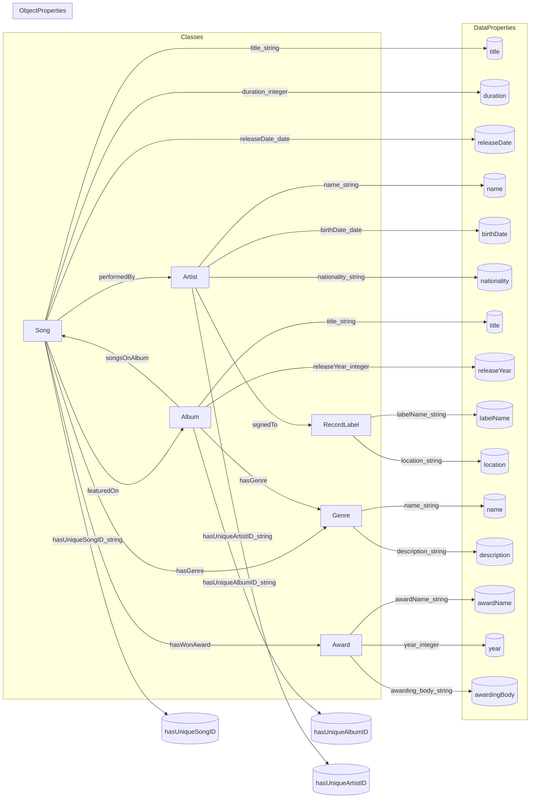

# Ontology Structure                                                                            
                                                                              
```mermaid                                                                              
classDiagram                                                        
    class Song {                                                
		%% Data Properties                                            
        -title : string                                                        
        -duration : int                                                        
        -releaseDate : date                                                
		%% Object Properties                                            
        +performedBy 1--* Artist : one-to-many                                                        
        +featuredOn o--1 Album  : one-to-one                                                       
        +hasGenre 1--* Genre  : one-to-many                                                       
        +hasWonAward o--1 Award   : one-to-many                                                      
    }                                                        
                                                        
    class Artist {                                                        
		%% Data Properties                                            
        -name : string                                                        
        -birthDate : date                                                        
        -nationality : string                                                        
		%% Object Properties                                            
        +signedTo o--1 RecordLabel                                                        
    }                                                        
                                                        
    class Album {                                                        
		%% Data Properties                                            
        -album_title : string                                                        
        -releaseYear : int                                                        
		%% Object Properties                                            
        +hasGenre *--1 Genre                                                        
    }                                                        
                                                        
  class RecordLabel{                                                        
		%% Data Properties                                            
        -label_name : string                                                        
        -location : string                                                        
  }                                                        
                                                        
    class Genre {                                                        
		%% Data Properties                                            
        -genre_name : string                                                        
        -description : string                                                        
    }                                                        
                                                        
  class Award{                                                        
		%% Data Properties                                            
        -award_name : string                                                        
        -year : int                                                        
        -awarding_body : string                                                        
  }                                                        
                                                        
  class Single{                                                        
		%% Data Properties                                            
		-isStandalone : boolean                                                        
  }                                                        
                                                        
  class ExtendedPlay{                                                        
		%% Data Properties                                            
		-numberOfTracks : int                                                        
  }                                                        
                                                        
    Song "1" --> "*" Artist : Association (performedBy)                                            
    Song "1" --> "*" Album : Association (featuredOn)                                            
    Song "1" --> "*" Genre : Association (hasGenre)                                            
    Song "1" --> "*" Award : Association (hasWonAward)                                            
    Artist "1" --> "1" RecordLabel : Association (signedTo)                                            
    Album "1" --> "*" Genre : Association (hasGenre)                                            
    Album "1" --> "*" Artist : Association (releasedBy)                                            
    Album "1" --> "1" RecordLabel : Association (releasedBy)                                            
    Artist "1" --> "*" Award : Association (hasWonAward)                                            
                                                
    Single --|> Song : Inheritance                                            
    ExtendedPlay --|> Album : Inheritance                                                       
```                                                                 
                                                                            
---                                                  
                                                  
```pseudocode                                                
Class: Song                                                
   - title: string                                                
   - duration: integer (seconds)                                                
   - releaseDate: date                                                
   - performedBy -> Artist (1..*)                                                
   - featuredOn -> Album (0..1)  // A song typically belongs to one album, though singles might have none                                                
   - hasGenre -> Genre (1..*)    // A song can fit multiple genres (e.g., Rock & Pop)                                                
   - hasWonAward -> Award (0..*)                                                
                                                
Class: Artist                                                
   - name: string                                                
   - birthDate: date                                                
   - nationality: string                                                
   - signedTo -> RecordLabel (0..1)  // many are unsigned/independent or signed to exactly one label                                                
                                                
Class: Album                                                
   - album_title: string                                                
   - releaseYear: integer                                                
   - hasGenre -> Genre (1..*)                                                
   - // we can also keep track of songs via the inverse of featuredOn                                                
                                                
Class: RecordLabel                                                
   - label_name: string                                                
   - location: string                                                
                                                
Class: Genre                                                
   - genre_name: string                                                
   - description: string                                                
                                                
Class: Award                                                
   - award_name: string                                                
   - year: integer                                                
   - awarding_body: string                                                
```                                                 
                                                  
*(Cardinality can be adjusted. For example, an artist could be signed to multiple labels in different regions, but we’ll keep it simple.)*                                                  
                                          
---                                        
                                          
A slightly more detailed diagram. Not terribly informative, trying to render the information differently does provide more insights.    
Additionally, I wanted to put something in that could highlight `owlrl` type reasoning in a simple LR diagram.                                
                                   
                                     

                                  
                                  
  .