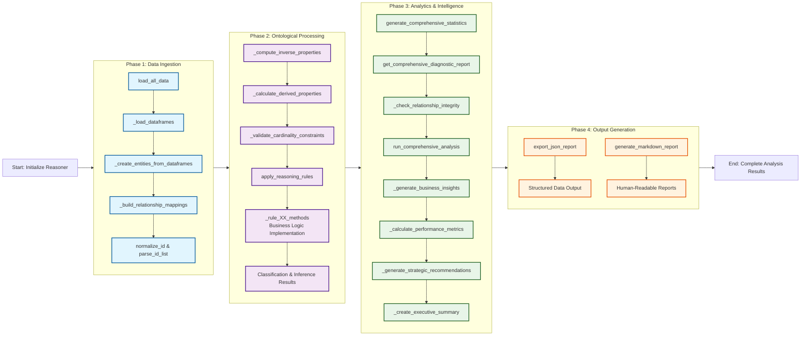

# Ontology #3: Supply Chain                                  
We are now trying to analyze and build an ontology that is scenario-driven, imagine a Manufacturer to Retailer chain, focusing on the flow of goods and the business processes (orders, shipments, invoices) that link the major players.                                   
It may appear slightly more complex than the earlier examples, reflecting multi-step relationships and partial coverage of real-world logistics.                                   
But, it's really not complex IMO. :)                                    
                        
---                        
                                
# Scenario-Driven Approach to Ontology Design                                
                                
1. **Identify Core Scenarios**:                                  
   - How does inventory move from **Suppliers** to **Manufacturers**?                                  
   - How does finished product get from **Manufacturers** to **Warehouses/DistributionCenters**?                                  
   - How do **Retailers** order from these distribution centers?                                  
   - How do **Shipments** and **Orders** tie together?                                  
                                
2. **List the Key “Players”** (Entities/Classes) in Each Scenario:                                  
   - **Supplier**, **Manufacturer**, **Warehouse** or **DistributionCenter**, **Retailer**, **Product**, **Order**, **Shipment**, **Invoice**, etc.                                
                                
3. **Capture Relationships**:                                  
   - “A **Supplier** provides raw materials to a **Manufacturer**.”                                  
   - “A **Manufacturer** transforms raw materials into finished **Products**.”                                  
   - “A **Warehouse** stores **Products** and ships them to **Retailers**.”                                  
   - “An **Order** is placed by a **Retailer** to a **Warehouse** for certain **Products**.”                                  
   - “A **Shipment** fulfills that **Order**.”                                  
                                
4. **Decide on Attributes (Data Properties)**:                                  
   - E.g., **Order**: order date, status, total cost, etc.                                  
   - E.g., **Shipment**: shipment date, method (air, sea, truck), tracking number, etc.                                  
                                
5. **Iterate, Expand, and Refine**:                                  
   - Add or remove entities as you refine your workflows.                                  
   - Confirm cardinalities (is a Product always made by exactly one Manufacturer, or can there be multiple?).                                  
                                
---                        
                        
		                        
## Scope                                
                                
- We aim to capture the flow of **raw materials** from suppliers, through manufacturing, warehousing, and distribution, up to retailers.                                  
- We’ll track **products**, **orders**, and **shipments** along this chain.                                  
- We assume different entity types (supplier, manufacturer, retailer) for clarity, though some companies can perform multiple roles.                                
                                
---                             
                                  
## Ontology Structure                                                                        
                                                                          
```mermaid                                                                          
classDiagram                                    
    class Supplier {                                    
        %% Data Properties                                    
        supplierName : string                                    
        location : string                                    
        rating : float                                    
        %% Object Properties                                    
        suppliesTo *--o Manufacturer : many-to-many                                    
    }                                    
                                    
    class Manufacturer {                                    
        %% Data Properties                                    
        manufacturerName : string                                    
        location : string                                    
        capacity : int                                    
        %% Object Properties                                    
        manufactures *--o Product : many-to-many                                    
        suppliedBy o--* Supplier : many-to-many                                    
    }                                    
                                    
    class Warehouse {                                    
        %% Data Properties                                    
        warehouseName : string                                    
        location : string                                    
        capacity : int                                    
        %% Object Properties                                    
        stores *--o Product : many-to-many                                    
        ships *--1 Shipment : one-to-many                                    
    }                                    
                                    
    class Retailer {                                    
        %% Data Properties                                    
        retailerName : string                                    
        location : string                                    
        retailerType : string                                    
        %% Object Properties                                    
        ordersFrom *--o Warehouse : many-to-many                                    
        ordersFrom *--o Manufacturer : many-to-many                                    
        receivesInvoice 1--* Invoice: one-to-many                                    
    }                                    
                                    
    class Product {                                    
        %% Data Properties                                    
        productName : string                                    
        sku : string                                    
        productType : string                                    
        unitPrice : float                                    
        %% Object Properties                                    
        manufacturedBy o--* Manufacturer : many-to-many                                    
        storedIn o--* Warehouse : many-to-many                                    
        orderLineOf o--* Order : many-to-many                                    
                                    
    }                                    
                                    
    class Order {                                    
        %% Data Properties                                    
        orderNumber : string                                    
        orderDate : date                                    
        status : string                                    
        totalAmount : float                                    
        %% Object Properties                                    
        hasOrderLine *--o Product : many-to-many                                    
        shippedIn 1--1 Shipment : one-to-one                                    
                                    
    }                                    
                                    
    class Shipment {                                    
        %% Data Properties                                    
        shipmentID : string                                    
        shipDate : date                                    
        carrier : string                                    
        trackingNumber : string                                    
        %% Object Properties                                    
        shipsOrder 1--1 Order : one-to-one                                    
        hasShipper 1--1 Warehouse : one-to-one                                    
        hasShipper o--1 Manufacturer: one-to-one                                    
    }                                    
                                    
    class Invoice {                                    
        %% Data Properties                                    
        invoiceNumber : string                                    
        invoiceDate : date                                    
        amountDue : float                                    
        dueDate : date                                    
        %% Object Properties                                    
        billedBy o--1 Warehouse : one-to-one                                    
        billedBy o--1 Manufacturer : one-to-one                                    
        billedTo 1--* Retailer : many-to-one                                    
    }                                    
                                    
    %% Relationships                                    
    Manufacturer "0..*" --o "0..*" Supplier : Association (suppliesTo)                                    
    Manufacturer "0..*" --o "0..*" Product : Association (manufactures)                                    
    Warehouse "0..*" --o "0..*" Product : Association (stores)                                    
    Retailer "0..*" --o "0..*" Warehouse : Association (ordersFrom)                                    
    Retailer "0..*" --o "0..*" Manufacturer : Association (ordersFrom)                                    
    Order "0..*" --o "1..*" Product : Association (hasOrderLine)                                    
    Shipment "1..1" -- "1..1" Order : Association (shipsOrder)                                    
    Shipment "1..1" -- "1..1" Warehouse : Association (hasShipper)                                    
    Shipment "0..1" -- "1..1" Manufacturer : Association (hasShipper)                                    
    Invoice "1..1" --o "0..1" Warehouse : Association (billedBy)                                    
    Invoice "1..1" --o "0..1" Manufacturer : Association (billedBy)                                    
    Invoice "1..*" -- "1..1" Retailer : Association (billedTo)                                                  
```                                                             
                                                                        
---                            
                        
                                
## Classes (Primary Entities)                                
                                
1. **Supplier**                                  
   - Provides raw materials or components.                                
                                
2. **Manufacturer**                                  
   - Receives materials from suppliers, creates finished products.                                
                                
3. **Warehouse** (or **DistributionCenter**)                                  
   - Stores finished products, handles dispatch to retailers.                                
                                
4. **Retailer**                                  
   - Sells products to end customers, places orders to warehouses or directly to manufacturers.                                
                                
5. **Product**                                  
   - Represents either raw materials or finished goods (for simplicity, we’ll treat them both under `Product` but we can subtype if needed).                                
                                
6. **Order**                                  
   - A request from a buyer (Retailer) to a seller (Warehouse or Manufacturer) for certain products.                                
                                
7. **Shipment**                                  
   - A physical movement of goods (fulfillment of an Order).                                
                                
8. **Invoice** (Optional for more complexity)                                  
   - A record of charges for a completed shipment or order.                                
                                
---                                
                                
## Object Properties (Relationships)                                
                                
1. `suppliesTo` (Supplier → Manufacturer)                                  
   - A supplier provides raw materials to a manufacturer.                                
                                
2. `manufactures` (Manufacturer → Product)                                  
   - A manufacturer creates certain products.                                
                                
3. `stores` (Warehouse → Product)                                  
   - A warehouse stores certain products in inventory.                                
                                
4. `ordersFrom` (Retailer → Warehouse or Manufacturer)                                  
   - A retailer places orders to a warehouse (most commonly) or sometimes directly to a manufacturer.                                
                                
5. `hasOrderLine` (Order → Product)                                  
   - Each order references one or more products (with quantities).                                
                                
6. `shipsOrder` (Shipment → Order)                                  
   - A shipment fulfills (or partially fulfills) an order.                                
                                
7. `hasShipper` (Shipment → Warehouse)                                  
   - The warehouse or distribution center that dispatches the shipment.                                
                                
8. `billedBy` (Invoice → Warehouse or Manufacturer)                                  
   - The entity that issues the invoice.                                
                                
9. `billedTo` (Invoice → Retailer)                                  
   - The retailer that receives the invoice.                                
                                
*(these are going to sound different and maybe even called a different noun depending on who you talk to and they source system you use)*                                
                                
---                                
                                
## Data Properties (Attributes)                                
                                
### **Supplier**                                
- `supplierName` (string)                                  
- `location` (string)                                  
- `rating` (float) – e.g. quality rating                                  
                                
### **Manufacturer**                                
- `manufacturerName` (string)                                  
- `location` (string)                                  
- `capacity` (integer) – e.g., max units produced per month                                  
                                
### **Warehouse**                                
- `warehouseName` (string)                                  
- `location` (string)                                  
- `capacity` (integer) – storage capacity                                  
                                
### **Retailer**                                
- `retailerName` (string)                                  
- `location` (string)                                  
- `retailerType` (string) – e.g., “Online,” “Brick-and-mortar”                                  
                                
### **Product**                                
- `productName` (string)                                  
- `sku` (string) – unique stock keeping unit                                  
- `productType` (string) – e.g., “RawMaterial” vs. “FinishedGood”                                  
- `unitPrice` (float)                                  
                                
### **Order**                                
- `orderNumber` (string)                                  
- `orderDate` (date)                                  
- `status` (string) – e.g., “Pending,” “Shipped,” “Delivered”                                  
- `totalAmount` (float)                                  
                                
*(We might also store the line-level details, e.g., quantity for each product, either as part of the order or a separate concept “OrderLine.”)*                                  
                                
### **Shipment**                                
- `shipmentID` (string)                                  
- `shipDate` (date)                                  
- `carrier` (string) – e.g., “UPS,” “FedEx,” etc.                                  
- `trackingNumber` (string)                                  
                                
### **Invoice**                                
- `invoiceNumber` (string)                                  
- `invoiceDate` (date)                                  
- `amountDue` (float)                                  
- `dueDate` (date)                                  
                                
---                                
                                             
                                              
```pseudocode                                            
Class: Supplier                                    
   - supplierName: string                                    
   - location: string                                    
   - rating: float                                    
   - suppliesTo -> Manufacturer (0..*)                                    
                                    
Class: Manufacturer                                    
   - manufacturerName: string                                    
   - location: string                                    
   - capacity: int                                    
   - manufactures -> Product (0..*)                                    
                                    
Class: Warehouse                                    
   - warehouseName: string                                    
   - location: string                                    
   - capacity: int                                    
   - stores -> Product (0..*)                                    
                                    
Class: Retailer                                    
   - retailerName: string                                    
   - location: string                                    
   - retailerType: string                                    
   - ordersFrom -> Warehouse or Manufacturer (?)                                    
                                    
Class: Product                                    
   - productName: string                                    
   - sku: string                                    
   - productType: string                                    
   - unitPrice: float                                    
                                    
Class: Order                                    
   - orderNumber: string                                    
   - orderDate: date                                    
   - status: string                                    
   - totalAmount: float                                    
   - hasOrderLine -> Product (0..*)   // or a separate object for each line                                    
                                    
Class: Shipment                                    
   - shipmentID: string                                    
   - shipDate: date                                    
   - carrier: string                                    
   - trackingNumber: string                                    
   - shipsOrder -> Order (1..1)                                    
   - hasShipper -> Warehouse (1..1)   // or Manufacturer if shipping direct                                    
                                    
Class: Invoice                                    
   - invoiceNumber: string                                    
   - invoiceDate: date                                    
   - amountDue: float                                    
   - dueDate: date                                    
   - billedBy -> Warehouse or Manufacturer                                    
   - billedTo -> Retailer                                    
                                    
```                                             
                                              
*Note: It's superfluous for me to mention that this is no where close to the complexity of a real-world supply chain, which can be far more complex, with sub-assemblies, multi-tier suppliers, partial shipments, returns, etc. We’re keeping it “complex enough” to illustrate the domain.*                                              
  
# building the reasoner
  
If you notice, this is approximately the flow we see in the reasoner:   
  

similarly here's the flow we use for the usage component:

```mermaid
flowchart LR
    A[Start: Initialize Analytics Engine] --> InitPhase
    
    subgraph InitPhase ["Phase 1: Analysis Initialization"]
        B1[run_comprehensive_analysis]
        B2[Import Reasoner Results]
        B3[Initialize Business Intelligence]
        B4[Set Analysis Parameters]
        
        B1 --> B2
        B2 --> B3
        B3 --> B4
    end
    
    InitPhase --> InsightPhase
    
    subgraph InsightPhase ["Phase 2: Business Intelligence Generation"]
        C1[_generate_business_insights]
        C2[_calculate_health_score]
        C3[_assess_domain_risks]
        C4[_analyze_stakeholder_value]
        C5[_analyze_operational_excellence]
        C6[_analyze_market_position]
        
        C1 --> C2
        C2 --> C3
        C3 --> C4
        C4 --> C5
        C5 --> C6
    end
    
    InsightPhase --> MetricsPhase
    
    subgraph MetricsPhase ["Phase 3: Performance Assessment"]
        D1[_calculate_performance_metrics]
        D2[_calculate_financial_kpis]
        D3[_calculate_operational_kpis]
        D4[_calculate_quality_kpis]
        D5[_calculate_strategic_kpis]
        D6[_calculate_domain_specific_metrics]
        
        D1 --> D2
        D2 --> D3
        D3 --> D4
        D4 --> D5
        D5 --> D6
    end
    
    MetricsPhase --> StrategyPhase
    
    subgraph StrategyPhase ["Phase 4: Strategic Planning"]
        E1[_generate_strategic_recommendations]
        E2[_identify_competitive_advantages]
        E3[_identify_growth_opportunities]
        E4[_identify_bottlenecks]
        E5[_identify_quick_wins]
        E6[_calculate_financial_impact]
        E7[_create_executive_summary]
        
        E1 --> E2
        E2 --> E3
        E3 --> E4
        E4 --> E5
        E5 --> E6
        E6 --> E7
    end
    
    StrategyPhase --> OutputPhase
    
    subgraph OutputPhase ["Phase 5: Reporting & Output"]
        F1[export_json_report]
        F2[generate_markdown_report]
        F3[_create_markdown_content]
        F4[Structured Analytics Data]
        F5[Executive Dashboard Reports]
        F6[Strategic Action Plans]
        
        F1 --> F4
        F2 --> F3
        F3 --> F5
        F4 --> F6
        F5 --> F6
    end
    
    OutputPhase --> G[End: Complete Business Intelligence Output]
    
    %% Parallel Helper Methods
    subgraph HelperMethods ["Universal Helper Methods"]
        H1[_calculate_efficiency_scores]
        H2[_analyze_trend_patterns]
        H3[_perform_benchmarking]
        H4[_assess_compliance_status]
        H5[_calculate_roi_projections]
        H6[_generate_alerting_rules]
    end
    
    InsightPhase -.-> HelperMethods
    MetricsPhase -.-> HelperMethods
    StrategyPhase -.-> HelperMethods
    
    %% Styling
    classDef initPhase fill:#e3f2fd,stroke:#0277bd,stroke-width:2px
    classDef insightPhase fill:#f1f8e9,stroke:#388e3c,stroke-width:2px
    classDef metricsPhase fill:#fff3e0,stroke:#f57c00,stroke-width:2px
    classDef strategyPhase fill:#fce4ec,stroke:#c2185b,stroke-width:2px
    classDef outputPhase fill:#f3e5f5,stroke:#7b1fa2,stroke-width:2px
    classDef helperPhase fill:#fafafa,stroke:#616161,stroke-width:1px,stroke-dasharray: 5 5
    
    class B1,B2,B3,B4 initPhase
    class C1,C2,C3,C4,C5,C6 insightPhase
    class D1,D2,D3,D4,D5,D6 metricsPhase
    class E1,E2,E3,E4,E5,E6,E7 strategyPhase
    class F1,F2,F3,F4,F5,F6 outputPhase
    class H1,H2,H3,H4,H5,H6 helperPhase
```

