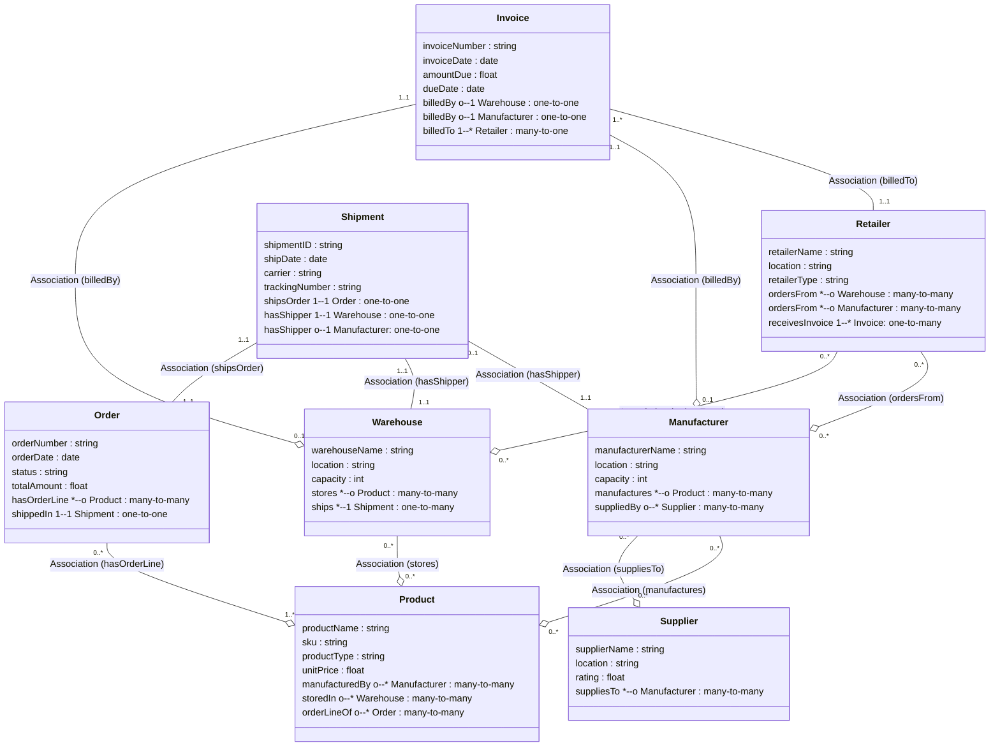

# Ontology Structure                                        
                                          

                                        
---              
              
```pseudocode            
Class: Supplier    
   - supplierName: string    
   - location: string    
   - rating: float    
   - suppliesTo -> Manufacturer (0..*)    
    
Class: Manufacturer    
   - manufacturerName: string    
   - location: string    
   - capacity: int    
   - manufactures -> Product (0..*)    
    
Class: Warehouse    
   - warehouseName: string    
   - location: string    
   - capacity: int    
   - stores -> Product (0..*)    
    
Class: Retailer    
   - retailerName: string    
   - location: string    
   - retailerType: string    
   - ordersFrom -> Warehouse or Manufacturer (?)    
    
Class: Product    
   - productName: string    
   - sku: string    
   - productType: string    
   - unitPrice: float    
    
Class: Order    
   - orderNumber: string    
   - orderDate: date    
   - status: string    
   - totalAmount: float    
   - hasOrderLine -> Product (0..*)   // or a separate object for each line    
    
Class: Shipment    
   - shipmentID: string    
   - shipDate: date    
   - carrier: string    
   - trackingNumber: string    
   - shipsOrder -> Order (1..1)    
   - hasShipper -> Warehouse (1..1)   // or Manufacturer if shipping direct    
    
Class: Invoice    
   - invoiceNumber: string    
   - invoiceDate: date    
   - amountDue: float    
   - dueDate: date    
   - billedBy -> Warehouse or Manufacturer    
   - billedTo -> Retailer    
    
```             
              
*Note: Real supply chains can be far more complex, with sub-assemblies, multi-tier suppliers, partial shipments, returns, etc. We’re keeping it “complex enough” to illustrate the domain.*              
  