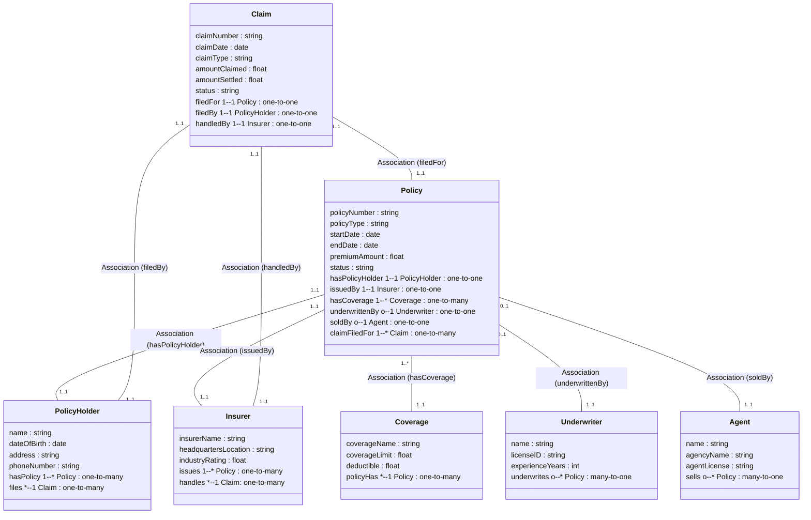

# Ontology #4: Insurance: Specifically thinking about Ontologies in Palantir Foundry                  
                
                
---                
                    
## Ontology Structure                                                        
                                                          

                                                        
---                        
                
# The Overall Purpose of an Ontology in Palantir Foundry                
                
In **Palantir Foundry**, an **ontology** primarily serves to:                
                
1. **Unify** multiple datasets under a consistent, semantic model – “one source of truth” for how data is named, typed, and related.                  
2. **Map** domain concepts (like “Policy,” “Claim,” “Coverage,” or “Construction Task,” “Material,” “Invoice”) to **Object Types** or typed transformations in Foundry.                  
3. **Guide** pipeline **actions** by specifying **which fields** or relationships exist, ensuring that Foundry transformations produce or consume those fields in a consistent manner.                  
4. **Enforce** or at least highlight domain **constraints** and **relationships** so that data lineage, pipeline merges, and code-workbook logic remain correct.                
                
Essentially, the ontology in Foundry is **not** just a conceptual model, it less a knowledge representation and reasoning device and more a **driver** for Foundry’s data integration, transforms, and object definitions are built and maintained.                  
When scaled up to sufficient complexity, this is key for building digital-twins for critical areas in the org.                  
                
---                
                
# Comparing a “Regular” Ontology vs. a “Foundry” Ontology                
                
| Aspect                              | Regular / Generic Ontology                                 | Palantir Foundry Ontology                                              |                
|-------------------------------------|-----------------------------------------------------------|-------------------------------------------------------------------------|                
| **Primary Goal**                    | Semantic correctness, open-world reasoning, standard OWL. | Data alignment across Foundry pipelines, consistent typed transformations. |                
| **Representation**                  | Possibly OWL/RDF in a triple store.                        | Typically **Object Types** or typed data sets in Foundry, plus lineage logic. |                
| **Evolution** (versioning)          | Usually evolve in a Git-based or manual version system.    | Strict **branch/merge** in Foundry’s Git-like approach. Pipeline changes must sync. |                
| **Handling partial data**           | Open-world assumption (missing triple is not contradiction). | Foundry transformations must handle missing columns or partial coverage. |                
| **Renaming or removing properties** | Minimal constraints – just revise the ontology.            | Must carefully update pipeline references, or code-workbooks might break. |                
| **Validation**                      | Possibly SHACL, custom reasoners.                          | Foundry type-checks transformations, enforces consistent field usage.     |                
                
---                
                
# Designing Ontologies in a Palantir Foundry context                
                
## A. General Ontology Creation Approach (considering Palantir Foundry nuances)                
                
1. **Regular (Generic) Ontology**                  
   - We focus on standard **semantic** or **conceptual** models (classes, properties, constraints).                  
   - Possibly store in a triple store, or an RDF/OWL environment - here we have chosen to use Pseudocode instead.                  
   - We might do **SPARQL** or reasoners, rely on open-world assumptions - again, a bit out of bounds for now, network queries may come in handy in future though.                
                
2. **Palantir Foundry Ontology**                  
   - Foundry organizes data into **datasets**, **object types**, **lineage** transformations, and **schemas**.                  
   - Each “ontology concept” typically maps to either a Foundry **Object Type** (with fields/properties) or a set of **datasets** referencing each other.                  
   - **Versioning** and **branch merges** in Foundry might impact how you evolve classes or rename properties, so you must handle changes carefully.                  
   - Foundry’s **schema matching** or “type inference” can highlight data mismatches if the ontology structure diverges from actual dataset columns.                  
                
                  
In Foundry, you’re often designing an **object-based** or “type-based” model that physically ties to one or more underlying **datasets** (your “source data” or “transforms”).                  
The **ontology** is typically a higher-level conceptual representation, but you must keep in sync with how data pipelines feed or output columns in Foundry.                  
                  
                  
---                  
                
## Detailed Foundry based Approach considering Actions & Functions                
                
When **building** or **applying** an ontology in Foundry, certain steps become direct **actions** in your pipeline, while others become **functions** or transformation **logic**. For example:                
                
1. **Ontology Definition (Action)**                  
   - You define classes (e.g., “PolicyHolder,” “Policy,” “Claim,” “Supplier,” “Invoice,” etc.) and relationships (“filedBy,” “belongsToProject,” etc.). This is a **design action** – you create or update the “blueprint” for object types.                
                
2. **Data Registration (Action)**                  
   - You register raw or source datasets into Foundry. This is an **action** – you import data, giving it initial schema.                  
   - Then, you **map** data columns to ontology properties or object types – e.g., a dataset column `claim_number` might map to the ontology property `Claim.claimNumber`.                
                
3. **Schema Checking (Function)**                  
   - Foundry performs type inference or field mapping **functions**. For instance, it checks if `claim_number` is a string, matches `Claim.claimNumber` property. If mismatched, an error arises.                
                
4. **Transformations** (Combination of Actions & Functions)                  
   - Each transform pipeline step is an **action** in Foundry that can apply **functions** (like merges, expansions, date transformations) referencing the ontology property definitions.                  
   - E.g., “Compute `Claim.totalPaid` by summing line items from a referencing dataset” is a transformation **function** that writes to the `totalPaid` property – an **action** is you adding or editing that transformation in Foundry.                
                
5. **Branching & Merging (Action)**                  
   - When you rename a property or add a new class, that’s an ontology update **action** in a new Foundry branch. You test transformations (the **functions**) to ensure they succeed, then **merge** the changes to production.                
                
6. **Lineage & Security** (Actions & Functions)                  
   - Foundry automatically tracks lineage as you do transformations (the **actions**).                  
   - If you define a property “Claim.ssn” as sensitive, you set security rules (**function** to mask or restrict columns). This ensures consistent usage of ontology fields in a secure manner.                
                
---                      
                              
```pseudocode                            
Class: PolicyHolder                    
   - name: string                    
   - dateOfBirth: date                    
   - address: string                    
   - phoneNumber: string                    
                    
Class: Insurer                    
   - insurerName: string                    
   - headquartersLocation: string                    
   - industryRating: float                    
                    
Class: Underwriter                    
   - name: string                    
   - licenseID: string                    
   - experienceYears: int                    
                    
Class: Agent (optional)                    
   - name: string                    
   - agencyName: string                    
   - agentLicense: string                    
                    
Class: Coverage                    
   - coverageName: string                    
   - coverageLimit: float                    
   - deductible: float                    
                    
Class: Policy                    
   - policyNumber: string                    
   - policyType: string                    
   - startDate: date                    
   - endDate: date                    
   - premiumAmount: float                    
   - status: string                    
   - hasPolicyHolder -> PolicyHolder (1..1)                    
   - issuedBy -> Insurer (1..1)                    
   - hasCoverage -> Coverage (1..*)                    
   - underwrittenBy -> Underwriter (0..1)                    
   - soldBy -> Agent (0..1) // optional                    
                    
Class: Claim                    
   - claimNumber: string                    
   - claimDate: date                    
   - claimType: string                    
   - amountClaimed: float                    
   - amountSettled: float                    
   - status: string                    
   - filedFor -> Policy (1..1)                    
   - filedBy -> PolicyHolder (1..1)                    
   - handledBy -> Insurer (1..1)                    
                        
```                             
     
---   
    
# Applying This to our Insurance Ontology

**Ontology #4** has classes:

- **PolicyHolder**, **Insurer**, **Underwriter**, **Agent**, **Policy**, **Coverage**, **Claim**, plus relationships like `hasCoverage`, `issuedBy`, `filedBy`.  

### How Foundry Implementation Works

- **Object Types**:  
  - `PolicyHolder` object type referencing a dataset with personal info.  
  - `Policy` object type referencing a dataset with `policyNumber`, `policyType`, `premiumAmount`.  
  - `Claim` object type referencing a dataset with `claimNumber`, `amountSettled`, plus a link to `policyID`.  

- **Mapping**:  
  - You do an **action** to define or update the “Policy” object type in Foundry, specifying each property (`policyNumber`, `premiumAmount`, etc.).  
  - Then you define a **function** or transform that merges coverage lines from a second dataset, populating the `hasCoverage` relationship or coverage array.

- **Gotchas**:  
  1. **Renaming** “Coverage” fields in the ontology – must also rename columns in your transform steps or code-workbooks.  
  2. **Securing** personal data (like `PolicyHolder.address` or `phoneNumber`) – you define column-level restrictions in Foundry, ensuring the pipeline only reveals them to authorized roles.

- **Actions**:  
  - Creating or modifying the “Claim” object type.  
  - Setting up a pipeline step to join `Claim` dataset with `Policy` dataset by `policyID`.  

- **Functions**:  
  - A transform that calculates “on-time premium payment ratio” or “average settlement time” referencing these ontology properties.  