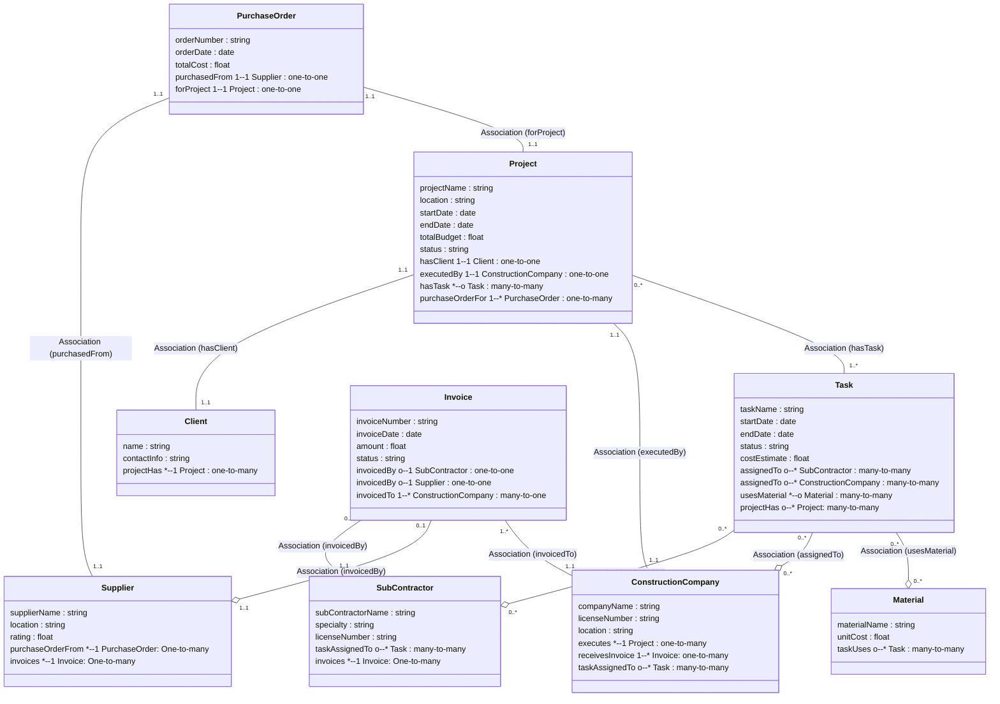

# Ontology #5: Construction 
  
## Ontology Structure                                    
                                      

                                    
---          
          
```pseudocode        
Class: Client
  - name: string
  - contactInfo: string

Class: ConstructionCompany
  - companyName: string
  - licenseNumber: string
  - location: string

Class: Project
  - projectName: string
  - location: string
  - startDate: date
  - endDate: date
  - totalBudget: float
  - status: string
  - hasClient -> Client (1..1)
  - executedBy -> ConstructionCompany (1..1)
  - hasTask -> Task (0..*)

Class: Task
  - taskName: string
  - startDate: date
  - endDate: date
  - status: string
  - costEstimate: float
  - assignedTo -> SubContractor or ConstructionCompany
  - usesMaterial -> Material (0..*)

Class: Material
  - materialName: string
  - unitCost: float

Class: Supplier
  - supplierName: string
  - location: string
  - rating: float (1..5)

Class: SubContractor
  - subContractorName: string
  - specialty: string
  - licenseNumber: string

Class: PurchaseOrder
  - orderNumber: string
  - orderDate: date
  - totalCost: float
  - purchasedFrom -> Supplier (1..1)
  - forProject -> Project (1..1)

Class: Invoice
  - invoiceNumber: string
  - invoiceDate: date
  - amount: float
  - status: string
  - invoicedBy -> SubContractor or Supplier
  - invoicedTo -> ConstructionCompany
    
```         
          
*(We could add many more details—like quantity, material unit-of-measure, labor hours, etc. We are still in early stages, for this exercise, this may be enough.)*          
  