# Ontology Structure                                        

```mermaid                                          
classDiagram    
    class Patient {    
        %% Data Properties    
        firstName : string    
        lastName : string    
        birthDate : date    
        gender : string    
        address : string    
        phoneNumber : string    
        %% Object Properties    
        encounterBelongsTo *--1 Encounter : one-to-many    
        patientCoverageReferences *--1 PatientCoverage : one-to-many    
        %% Rules    
        %% RULE: Each Patient must have at least one Encounter eventually.    
    }    
    
    class Provider {    
        %% Data Properties    
        providerName : string    
        licenseNumber : string    
        specialty : string    
        %% Object Properties    
        encounterAttendedBy *--o Encounter : Many-to-many    
    
        %% Rules    
        %% RULE: A Provider can be linked to many Encounters.    
    }    
    
    class HealthcareFacility {    
        %% Data Properties    
        facilityName : string    
        facilityType : string  %% e.g. "Hospital", "Clinic"    
        location : string    
        %% Object Properties    
        encounterOccursAt *--1 Encounter: one-to-many    
    }    
    
    class InsurancePayer {    
        %% Data Properties    
        payerName : string    
        payerType : string  %% e.g. "Private", "Medicare"    
        contactInfo : string    
        %% Object Properties    
        claimBilledTo *--1 Claim : one-to-many    
        patientCoverageReferences *--1 PatientCoverage : One-to-many    
    }    
    
    class Encounter {    
        %% Data Properties    
        encounterID : string    
        startDateTime : dateTime    
        endDateTime : dateTime    
        reasonForVisit : string    
        encounterType : string  %% e.g. "Inpatient", "Outpatient", "ER"    
        %% Object Properties    
        belongsTo 1--1 Patient : one-to-one    
        attendedBy *--o Provider : many-to-many    
        occursAt 1--1 HealthcareFacility : one-to-one    
        includesDiagnosis *--o Diagnosis : many-to-many    
        includesProcedure *--o Procedure : many-to-many    
        hasMedicationOrder *--o MedicationOrder : many-to-many    
        performedLabTest *--o LabTest : many-to-many    
        claimFor 1--* Claim : one-to-many    
        %% Rules    
        %% RULE: endDateTime >= startDateTime    
        %% RULE: A single Encounter belongs to exactly one Patient    
        %% RULE: If encounterType = 'Inpatient', then endDateTime - startDateTime >= 24h (hypothetical example)    
    }    
    
    class Diagnosis {    
        %% Data Properties    
        diagnosisCode : string    
        codeSystem : string  %% e.g. "ICD-10", "SNOMED"    
        diagnosisDesc : string    
        %% Object Properties    
        encounterIncludes o--* Encounter: Many-to-many    
        %% Rules    
        %% RULE: If codeSystem = "ICD-10", diagnosisCode must match an ICD-10 pattern or be in an ICD-10 code set    
    }    
    
    class Procedure {    
        %% Data Properties    
        procedureCode : string    
        codeSystem : string  %% e.g. "CPT", "HCPCS"    
        procedureDesc : string    
        procedureDate : dateTime    
        %% Object Properties    
        encounterIncludes o--* Encounter: Many-to-many    
        %% Rules    
        %% RULE: If codeSystem = "CPT", procedureCode must be in the CPT set    
        %% RULE: procedureDate must be between Encounter start/end    
    }    
    
    class MedicationOrder {    
        %% Data Properties    
        orderID : string    
        startDate : date    
        endDate : date    
        dosage : string    
        frequency : string    
        %% Object Properties    
        dispensedAs *--1 Medication : One-to-many  %%Simplified to one-to-many    
        encounterHas o--* Encounter : many-to-one    
        %% Rules    
        %% RULE: endDate >= startDate    
        %% RULE: Must link to 1 or more Medication(s)    
    }    
    
    class Medication {    
        %% Data Properties    
        brandName : string    
        genericName : string    
        rxNormCode : string    
        strength : string    
        %% Object Properties    
        medicationOrderDispensedAs 1--* MedicationOrder : one-to-many    
        %% Rules    
        %% RULE: If rxNormCode is present, it must be a valid RxNorm    
    }    
    
    class LabTest {    
        %% Data Properties    
        testID : string    
        testName : string    
        testCode : string  %% e.g. LOINC code    
        specimenType : string    
        %% Object Properties    
        hasResult *--o LabResult : many-to-many    
        encounterPerformed o--* Encounter: many-to-one    
        %% Rules    
        %% RULE: If codeSystem = "LOINC", testCode must be in LOINC set    
    }    
    
    class LabResult {    
        %% Data Properties    
        resultValue : float    
        units : string    
        referenceRange : string    
        resultDateTime : dateTime    
        %% Object Properties    
        labTesthas o--* LabTest: many-to-one    
        %% Rules    
        %% RULE: If test is "completed", must have at least one LabResult    
    }    
    
    class Claim {    
        %% Data Properties    
        claimNumber : string    
        claimDate : date    
        totalBilled : float    
        totalPaid : float    
        status : string  %% "Submitted", "Paid", "Denied"    
        %% Object Properties    
        billedTo 1--1 InsurancePayer : one-to-one    
        claimFor 1--1 Encounter : one-to-one    
        claimLineItemBelongsTo *--1 ClaimLineItem: One-to-many    
        %% Rules    
        %% RULE: If status = "Paid", then totalPaid <= totalBilled    
        %% RULE: claimDate >= encounter.endDateTime    
    }    
        
    class ClaimLineItem {    
        %%Data Properties    
        lineCode: string    
        billedAmount: float    
        allowedAmount: float    
        %%Object Properties    
        belongsTo 1--1 Claim : one-to-one    
    }    
    
    class PatientCoverage {    
        %%Data Properties    
        coverageStart: date    
        coverageEnd: date    
        %%Object Properties    
        referencesPayer 1--1 InsurancePayer    
        referencesPatient 1--1 Patient    
        %% Rules    
        %% RULE: claims must happen within coverage period for this payer    
    }    
    
    %% Relationships    
    Patient "1..1" -- "*" Encounter : Association (belongsTo)    
    Encounter "0..*" --o "1..*" Provider : Association (attendedBy)    
    Encounter "1..1" -- "1..1" HealthcareFacility : Association (occursAt)    
    Encounter "0..*" --o "1..*" Diagnosis : Association (includesDiagnosis)    
    Encounter "0..*" --o "1..*" Procedure : Association (includesProcedure)    
    Encounter "0..*" --o "1..*" MedicationOrder : Association (hasMedicationOrder)    
    Encounter "0..*" --o "1..*" LabTest : Association (performedLabTest)    
    Claim "1..1" -- "1..1" InsurancePayer : Association (billedTo)    
    Claim "1..1" -- "1..1" Encounter : Association (claimFor)    
    MedicationOrder "1..*" -- "1..1" Medication : Association (dispensedAs)    
    LabTest "0..*" --o "1..*" LabResult : Association (hasResult)    
    ClaimLineItem "1..1" -- "1..1" Claim : Association (belongsTo)    
    PatientCoverage "1..1" -- "1..1" InsurancePayer : Association(referencesPayer)    
    PatientCoverage "1..1" -- "1..1" Patient : Association(referencesPatient)    
```                             
                                          

                                        
---              
              
```pseudocode            
Class: Patient    
   - firstName: string    
   - lastName: string    
   - birthDate: date    
   - gender: string    
   - address: string    
   - phoneNumber: string    
   // RULE: Each Patient must have at least one Encounter eventually.    
    
Class: Provider    
   - providerName: string    
   - licenseNumber: string    
   - specialty: string    
   // RULE: A Provider can be linked to many Encounters.    
    
Class: HealthcareFacility    
   - facilityName: string    
   - facilityType: string   // e.g. "Hospital", "Clinic"    
   - location: string    
    
Class: InsurancePayer    
   - payerName: string    
   - payerType: string  // e.g. "Private", "Medicare"    
   - contactInfo: string    
    
Class: Encounter    
   - encounterID: string    
   - startDateTime: dateTime    
   - endDateTime: dateTime    
   - reasonForVisit: string    
   - encounterType: string  // e.g. "Inpatient", "Outpatient", "ER"    
   // RULE: endDateTime >= startDateTime    
   // RULE: A single Encounter belongs to exactly one Patient    
   // RULE: If encounterType = 'Inpatient', then endDateTime - startDateTime >= 24h (hypothetical example)    
    
   // RELATIONSHIPS:    
   - belongsTo -> Patient (1..1)    
   - attendedBy -> Provider (0..*)    
   - occursAt -> HealthcareFacility (1..1)    
   - includesDiagnosis -> Diagnosis (0..*)    
   - includesProcedure -> Procedure (0..*)    
   - hasMedicationOrder -> MedicationOrder (0..*)    
   - performedLabTest -> LabTest (0..*)    
    
Class: Diagnosis    
   - diagnosisCode: string    
   - codeSystem: string    // e.g. "ICD-10", "SNOMED"    
   - diagnosisDesc: string    
   // RULE: If codeSystem = "ICD-10", diagnosisCode must match an ICD-10 pattern or be in an ICD-10 code set    
    
Class: Procedure    
   - procedureCode: string    
   - codeSystem: string    // e.g. "CPT", "HCPCS"    
   - procedureDesc: string    
   - procedureDate: dateTime    
   // RULE: If codeSystem = "CPT", procedureCode must be in the CPT set    
   // RULE: procedureDate must be between Encounter start/end    
    
Class: MedicationOrder    
   - orderID: string    
   - startDate: date    
   - endDate: date    
   - dosage: string    
   - frequency: string    
   // RULE: endDate >= startDate    
   // RULE: Must link to 1 or more Medication(s)    
   // RELATIONSHIP:    
   - dispensedAs -> Medication (1..1 or 1..*) // depends on design    
    
Class: Medication    
   - brandName: string    
   - genericName: string    
   - rxNormCode: string    
   - strength: string    
   // RULE: If rxNormCode is present, it must be a valid RxNorm    
    
Class: LabTest    
   - testID: string    
   - testName: string    
   - testCode: string     // e.g. LOINC code    
   - specimenType: string    
   // RULE: If codeSystem = "LOINC", testCode must be in LOINC set    
   - hasResult -> LabResult (0..*)    
    
Class: LabResult    
   - resultValue: float    
   - units: string    
   - referenceRange: string    
   - resultDateTime: dateTime    
   // RULE: If test is "completed", must have at least one LabResult    
    
Class: Claim    
   - claimNumber: string    
   - claimDate: date    
   - totalBilled: float    
   - totalPaid: float    
   - status: string  // "Submitted", "Paid", "Denied"    
   // RULE: If status = "Paid", then totalPaid <= totalBilled    
   // RULE: claimDate >= encounter.endDateTime    
   // RELATIONSHIPS:    
   - billedTo -> InsurancePayer (1..1)    
   - claimFor -> Encounter (1..1)    
    
Class: ClaimLineItem (optional sub-structure)    
   - lineCode: string         // procedure or dx code    
   - billedAmount: float    
   - allowedAmount: float    
   - belongsTo -> Claim (1..1)    
    
Class: PatientCoverage (optional)    
   - coverageStart: date    
   - coverageEnd: date    
   - referencesPayer -> InsurancePayer    
   - referencesPatient -> Patient    
   // RULE: claims must happen within coverage period for this payer    
    
        
```             
      
### Encoding Rules and Limitations    
    
1. **Code System Constraints**: In a real OWL or SHACL environment, you might have pattern constraints (e.g., `xsd:pattern` for ICD-10 codes) or value-set membership checks.      
2. **Temporal** constraints: `endDateTime >= startDateTime`, `claimDate >= encounter.endDateTime`, etc.      
3. **Billing** constraints: `totalPaid <= totalBilled` if `status=Paid`.      
4. **Coverage** constraints: If coverage ends, claims after that date might be disallowed.      
    
*(In a truly formal approach, these might be expressed in SHACL, SWRL, or application-level validations. The pseudocode above indicates them as comments for clarity.)*