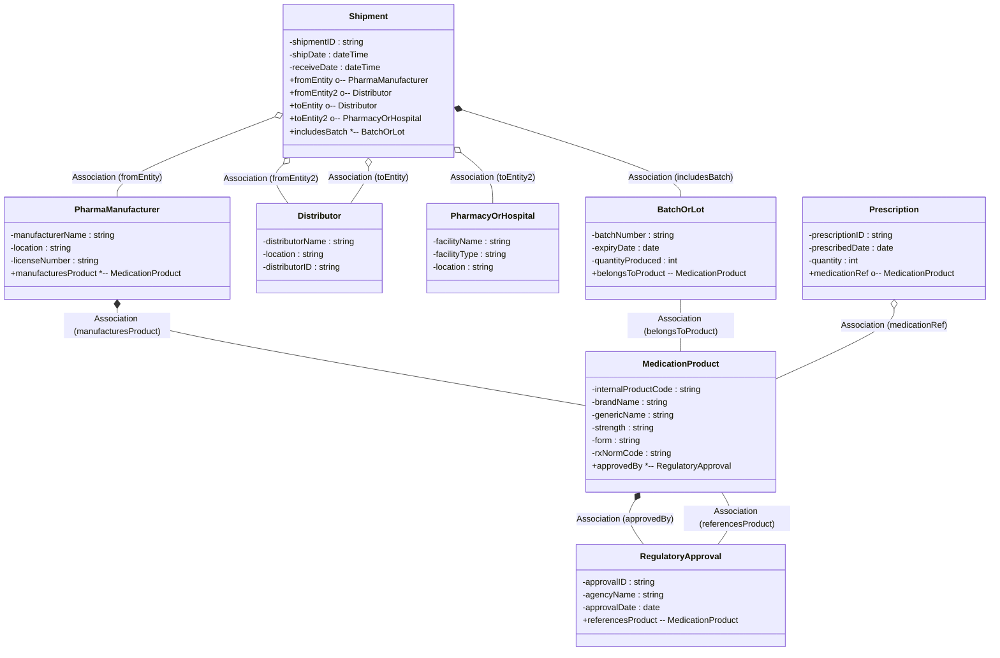

# Ontology #9: Pharmaceutical Supply Chain + Ontology Matching           
        
Ontology #9 uses the **Pharmaceutical Supply Chain** domain to explore **higher-order ontology operations**, such as **ontology matching** (aligning similar or overlapping concepts/terminologies across two or more ontologies).           
We will demonstrate both the **domain ontology** itself and how **matching** might work in a scenario where we have partially overlapping ontologies—typical in many real-world use cases.           
           
## 1. Domain Scope & Complexity        
        
This ontology models the **flow of pharmaceutical products** from **manufacturers** to **distributors** to **pharmacies/hospitals**, with **regulatory constraints** (e.g., FDA approvals), **batch/lot tracking**, and **prescription flows**. It overlaps concepts from **manufacturing**, **supply chain**, and **pharmacy** domains.        
        
Additionally, we’ll highlight a **“matching” scenario**: Suppose we have a separate “Clinical Ontology” (like a medication list using RxNorm) and a “Supply Chain Ontology” referencing internal product codes. **Ontology matching** is needed to align or unify references to the “same medication” across these two sets of concepts.        
        
---        
        
## 2. Ontology Structure: Core Classes / Entities (Domain Ontology)        
        
Below is a conceptual structure, with a **pseudocode** approach. We will highlight **matching** opportunities in comments.        
        
                                                      

                                                    
---                          
                          
```pseudocode                        
Class: PharmaManufacturer            
   - manufacturerName: string            
   - location: string            
   - licenseNumber: string  // e.g. FDA or other regulatory body            
   // Potentially references an external Manufacturer ID used in another ontology            
            
Class: Distributor            
   - distributorName: string            
   - location: string            
   - distributorID: string            
   // ROLE: Intermediary shipping or storing pharma products            
            
Class: PharmacyOrHospital            
   - facilityName: string            
   - facilityType: string  // "RetailPharmacy", "HospitalPharmacy"            
   - location: string            
            
Class: MedicationProduct            
   - internalProductCode: string    // unique code in supply chain            
   - brandName: string            
   - genericName: string            
   - strength: string            
   - form: string  // "Tablet", "Capsule", etc.            
   - rxNormCode: string    // This links to a clinical ontology code (matching scenario)            
   // Potentially a second code from some internal system (like "WMS-34342")            
            
Class: BatchOrLot            
   - batchNumber: string            
   - expiryDate: date            
   - quantityProduced: int            
   - belongsToProduct -> MedicationProduct (1..1)            
   // RULE: Each batch references exactly one MedicationProduct            
            
Class: Shipment            
   - shipmentID: string            
   - shipDate: dateTime            
   - receiveDate: dateTime            
   - fromEntity: could be (PharmaManufacturer or Distributor)            
   - toEntity: (Distributor or PharmacyOrHospital)            
   // RULE: fromEntity and toEntity must be different roles (no self-shipment).            
   - includesBatch -> BatchOrLot (0..*)            
            
Class: Prescription            
   - prescriptionID: string            
   - prescribedDate: date            
   - quantity: int            
   - medicationRef -> MedicationProduct            
   // Possibly references a separate "Patient" or "Doctor," but we keep it minimal here.            
            
Class: RegulatoryApproval            
   - approvalID: string            
   - agencyName: string  // e.g. "FDA"            
   - approvalDate: date            
   - referencesProduct -> MedicationProduct (1..1)            
   // RULE: If a product is sold in the U.S., must have FDA approval            
            
// Matching Scenario:             
// Suppose we have a separate "Clinical Ontology" with a class "Drug" (with rxNormCode).            
// We want to align "MedicationProduct" (in supply chain ontology) to "Drug" (in clinical ontology).            
// We can do an equivalence:             
//  MedicationProduct  owl:equivalentClass  Drug            
//  MedicationProduct.rxNormCode  owl:sameAs  Drug.rxNormCode            
// or use a bridging concept to unify them.            
```            
            
### Potential Matching Approach            
            
- If the separate **clinical ontology** has a class **Drug** with property `rxNormCode`, and our **MedicationProduct** also has `rxNormCode`, we could do an **ontology matching** rule:            
  - *“MedicationProduct and Drug are the same concept if they share the same rxNormCode.”*              
  - In formal terms, we might define a **SWRL** or **OWL** equivalence assertion:            
    - `MedicationProduct ≡ Drug` (some conditions)              
    - `MedicationProduct.rxNormCode = Drug.rxNormCode` implies `MedicationProduct` owl:sameAs `Drug`.              
            
*(This is a simplified example—real matching often uses more attributes and possibly string distance metrics on brand/generic names, etc.)*          
          
### Constraints / Matching        
        
- **Matching**: We store a `rxNormCode` in each `MedicationProduct`, indicating how it might align with a **clinical** or **prescribing** ontology that also uses rxNorm. In practice, we might do a bridging approach: `MedicationProduct` in supply chain → `Drug` in a “Clinical Ontology.” The bridging or alignment is handled by a rule:        
        
  ```        
  If (MedicationProduct.rxNormCode == Drug.rxNormCode) then        
     MedicationProduct owl:sameAs Drug.        
  ```        
          
- **Shipment**: We ensure `fromEntityID != toEntityID`, picking from the sets (Manufacturer + Distributor) → (Distributor + Pharmacy). This is a simplified approach; real logic might check that it’s not manufacturer→manufacturer or pharmacy→pharmacy, etc.        
        
- **RegulatoryApprovals**: We link them to an existing product ID. A real system would require certain constraints, e.g., “If product location = US, must have an FDA approval.” We skip that logic or do a partial approach by randomly picking an `agencyName`.        
