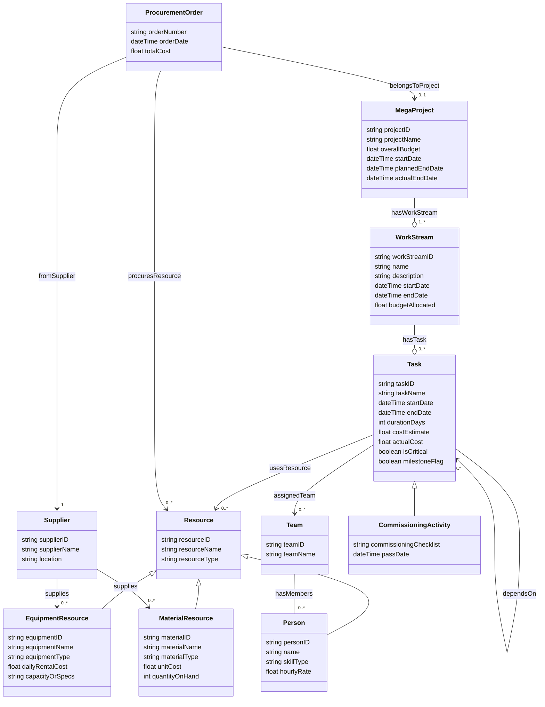

# Ontology #10: EPCC / LEMS / PMBOK Domain    

A **comprehensive explanation** of the **thought process**, **methodologies**, and **mental frameworks** behind **Ontology #10**—the EPCC/LEMS/PMBOK-based ontology for a large data center construction project.   
We’ll cover **why** we chose certain approaches, how **semantics** get established, and alternative ways one could have constructed or iterated upon this **complex** ontology.    
    
---    
    
## 1. Context and Overarching Goal    
    
### What is Ontology #10?    
    
- **Domain**: A large-scale **Engineering**, **Procurement**, **Construction**, and **Commissioning** (EPCC) project, aligned with **PMBOK** concepts for project management.      
- **Scope**: Tracks a massive data center construction with multiple workstreams (200+), thousands of tasks, and resources under the **LEMS** model (Labor, Equipment, Materials, Suppliers).      
    
**Core Challenge**: Represent the entire **project management** life cycle plus **resource** management, **supply chain** elements, **schedule** dependencies, and **commissioning** final steps, all in one integrated ontology.    
    
---    
    
## 2. Mental Frameworks and Methodologies    
    
### A. Competency Question / Scenario-Driven Approach    
One widely used approach is to start by **asking**: “What **questions** do we want to answer with this ontology?” or “What **scenarios** must the system handle?” For example:    
    
1. “Which tasks belong to which workstream, and how do they depend on each other?”      
2. “Which tasks are on the **critical path**, meaning no float/slack?”      
3. “Which **supplier** provides which **materials** or **equipment** for each **task**?”      
4. “When do we do **commissioning** tasks, and do they come after all construction tasks?”      
    
**Why it helps**:      
- The **competency questions** highlight key classes (Task, WorkStream, Supplier, Resource, etc.), relationships (dependsOn, usesResource, etc.), and constraints (temporal logic, critical path logic, etc.).    
    
### B. Nouns–Verbs–Adjectives (Grammar / Structural)    
- **Nouns (Classes)**: Project, WorkStream, Task, Resource (Labor, Equipment, Material), Supplier, Team, ProcurementOrder, CommissioningActivity.      
- **Verbs (Object Properties)**:     
  - *hasWorkStream*, *hasTask*, *dependsOn*, *usesResource*, *assignedTeam*, *supplies*, etc.      
- **Adjectives (Data Properties)**: name, cost, date, skillType, resourceType, etc.      
    
**Why it helps**:      
- This approach ensures we systematically capture **things** (classes), **relations** (verbs), and **descriptors** (properties).    
    
### C. PMBOK & LEMS Integration    
- **PMBOK** provides a **project management** perspective: tasks, phases (workstreams), dependencies, scheduling, resource planning.      
- **LEMS** ensures we explicitly represent **Labor** (personnel), **Equipment**, **Materials**, and **Suppliers**.      
- This merges a real **construction project** viewpoint (like a WBS with tasks, plus scheduling) with a **resource** supply chain viewpoint.    
    
### D. Iterative / Agile Ontology Building    
- We don’t finalize all classes from day one. We might start simpler: “Project–WorkStream–Task–Resource–Supplier.” Then **expand** with constraints (critical path logic, commissioning specifics, etc.).      
- **Why**: Real projects are complex. We refine as we identify new competency questions or constraints.    
    
### E. Combining Sub-Ontologies    
- A large domain can be broken into sub-ontologies:    
  1. **Project Scheduling** sub-ontology (Tasks, Dependencies, WorkStreams).      
  2. **Resource** sub-ontology (Labor, Equipment, Materials, Supplier).      
  3. **Procurement** sub-ontology (ProcurementOrder, supply relationships).      
  4. **Commissioning** sub-ontology (CommissioningActivity).      
- Then we unify them with bridging relationships (Task usesResource, CommissioningActivity extends Task, etc.).    
    
---    
    
## 3. Ontology Structure and Semantics    
    
**Semantics**: Each class and property has a **meaning** tied to the real-world EPCC domain:    
    
1. **MegaProject**: The highest-level concept, the entire data center build.      
2. **WorkStream**: Large sub-initiatives or phases (civil, electrical, IT).      
3. **Task**: The fundamental “activity” with **start/end** and **dependsOn** relationships.      
   - **Critical** path tasks have zero float.      
4. **Resource**: Abstract parent concept capturing the idea of a “thing used in a task.”      
   - **Person** (Labor) – has skill type, cost rate.      
   - **EquipmentResource** – daily rental cost, capacity.      
   - **MaterialResource** – unit cost, quantity, possibly a Supplier.      
5. **Supplier**: Entities that supply materials/equipment.      
6. **Team**: A grouping of labor resources (people). Some tasks might assign a single team for synergy.      
7. **ProcurementOrder**: The formal request/purchase from a Supplier for certain resources.      
8. **CommissioningActivity**: A specialized **Task** for final acceptance checks.    
    
**Why these classes**:      
- **Project** is big.      
- **WorkStream** organizes tasks into manageable subsets.      
- **Task** is the atomic building block of a schedule.      
- **Resource** captures everything needed to do tasks, from human skill to physical machines.      
- **Supplier** and **Procurement** reflect the supply chain dimension.      
- **Commissioning** tasks reflect a specialized final step.    
    
### Property Semantics    
    
- **dependsOn**: Captures **precedence** constraints—task T can’t start until all tasks it depends on finish.      
- **usesResource**: The resource usage dimension—Task T might “use” 5 laborers, 2 pieces of equipment, etc.      
- **hasWorkStream** / **hasTask**: The hierarchical structure from project → workstream → tasks.      
    
### Constraints / Rules    
    
- **Temporal** (start/end date alignment).      
- **No circular** dependencies.      
- **Critical path** definition (zero slack tasks).      
- **Material** must be procured from **Supplier** (either direct or via a ProcurementOrder).      
    
In **OWL** or **SHACL**, we might encode constraints (e.g., “If a task dependsOn T1, then T1.endDate ≤ ThisTask.startDate.”). The script partially enforces them by sorting tasks and picking only tasks that end earlier as dependencies.    
    
---    
    
## 4. Alternative Approaches    
    
1. **Top-Down** (Project-first) vs. **Bottom-Up** (Resource-first):      
   - We used a top-down approach: define project, then break it into streams, then tasks, referencing resources.      
   - A bottom-up approach might define a resource catalog, then tasks referencing them, then group tasks into streams, etc.      
    
2. **Middle-Out**:      
   - Start with the key concept of **Task** (since it’s central to scheduling), then expand “what does a task need? (resources, dependencies).” Then define “which tasks form a workstream?” etc.      
    
3. **Agile** or **Incremental**:      
   - Start small with “Project → Tasks → People.”      
   - Add “Equipment,” “Material,” “Supplier,” “Procurement,” “Commissioning” in phases.      
   - Each iteration you test your queries and refine the classes or properties.    
    
4. **Big-Bang** / Comprehensive:      
   - As we did, we gather all known requirements from PMBOK, from the supply chain vantage, from resource management vantage, and unify them.      
   - Large but can be done if you have a stable domain model.    
    
---    
    
## 5. How the Semantics and Meanings Work    
    
- **Epistemic**: The ontology treats scheduling data in an **open world** sense, but we embed partial “closed-world–like” constraints in the script (no circular dependencies, references must exist).      
- **Meaning**:     
  - “Task dependsOn T2” means in a real schedule, T2 must finish before T can start.      
  - “Task usesResource R” means R is allocated to T for that timeframe.      
  - “ProcurementOrder from S for M” means we have a supply chain transaction.      
    
**Relationships** are thus more than just “links”—they convey **causality** (dependencies), **usage** (resource application), **ownership** (project hasWorkStream), etc.    
    
---    
    
## 6. Key Takeaways    
    
1. **Large Domain**: We unify **PMBOK** scheduling with **LEMS** resources and **supplier** relationships.      
2. **Methodologies**: We leveraged **competency questions** (what do we need to answer?), **scenario-driven** approach (engineering + supply chain + commissioning), plus **nouns–verbs–adjectives** logic to systematically discover classes, properties, and constraints.      
3. **Generation Sequence**:      
   1. **Projects** → 2. **WorkStreams** → 3. **Resources** (Labor, Equip, Materials), **Suppliers** → 4. **Teams** → 5. **ProcurementOrders** → 6. **Tasks** (+ Commissioning tasks) → 7. **Dependencies** → 8. **Critical Path** marking.      
4. **Scale & Complexity**: Enough tasks (thousands per project), enough resources (hundreds or thousands of items of various types), enough concurrency (~30% overlap) to replicate real **mega** data center builds.    
    
Hence, the **intuitive** approach is to reflect **real workflows**:    
    
- You define the **project** and **streams** first, so you have an idea of high-level phases.      
- You define or import the resource catalogs (people/skills, equipment, materials) plus supplier relationships.      
- You place orders for these resources (Procurement).      
- You define your tasks referencing the streams, scheduling them with dependencies, resources, plus specialized tasks for commissioning.      
- Finally, you compute scheduling properties like the **critical path**.    
    
All these reflect the **semantics** (meaningful domain relationships) and **rules** to produce a **cohesive** EPCC/LEMS/PMBOK ontology that closely resembles actual large-scale construction project management.

        
# 7. Ontology Structure                                                        
                                                          

                                                        
---                              
                              
```pseudocode                            
Class: MegaProject                
   - projectID: string                // Unique project identifier                
   - projectName: string              // E.g., "Mega DataCenter Construction"                
   - overallBudget: float             // Total allocated budget                
   - startDate: dateTime              // Project start (must be ≤ plannedEndDate)                
   - plannedEndDate: dateTime         // Planned completion date                
   - actualEndDate: dateTime (optional) // Recorded completion, if finished                
                
   // Relationships:                
   - hasWorkStream -> WorkStream (1..*)                  
     // RULE: A MegaProject must consist of one or more WorkStreams.                
                  
Class: WorkStream                
   - workStreamID: string             // Unique identifier (e.g., WS-1001)                
   - name: string                     // Descriptive name (e.g., "HVAC & Cooling")                
   - description: string              // Brief details                
   - startDate: dateTime              // Must be within the MegaProject's timeframe                
   - endDate: dateTime                // Must be later than startDate and ≤ MegaProject.plannedEndDate                
   - budgetAllocated: float           // Portion of project budget                
                
   // Relationships:                
   - belongsToProject -> MegaProject (1..1)                
   - hasTask -> Task (0..*)                
   // RULE: Each WorkStream is associated with exactly one MegaProject.                
                   
Class: Task                
   - taskID: string                   // Unique identifier (e.g., TK-1050)                
   - taskName: string                 // E.g., "Pour Foundation"                
   - startDate: dateTime              // Actual or scheduled start; must be ≥ WorkStream.startDate                
   - endDate: dateTime                // Must be > startDate and ideally ≤ WorkStream.endDate                
   - durationDays: int                // Computed or estimated duration                
   - costEstimate: float              // Planned cost for this task                
   - actualCost: float                // Actual cost (may update during progress)                
   - isCritical: boolean              // TRUE if on the critical path (computed from dependencies)                
   - milestoneFlag: boolean           // TRUE if task represents a project milestone                
                
   // Relationships:                
   - belongsToWorkStream -> WorkStream (0..1)                  
     // RULE: Typically, a Task belongs to a single WorkStream; if not, it must reference the overall project.                
   - dependsOn -> Task (0..*)         // List of taskIDs this task depends on                
      // RULE: For any dependency, the dependent Task’s startDate must be ≥ the dependency’s endDate.                
   - usesResource -> Resource (0..*)  // Resources (Labor, Equipment, Material) assigned to the task                
   - assignedTeam -> Team (0..1)        // Optional: a dedicated team performing the task                
Class: Resource (abstract)                
   - resourceID: string               // Unique identifier                
   - resourceName: string             // Descriptive name                
   - resourceType: string             // One of: "Labor", "Equipment", "Material"                
                   
Class: Person  (represents a labor resource)                
   - personID: string                 // Unique employee identifier (e.g., EMP-5001)                
   - name: string                
   - skillType: string                // E.g., "CivilEngineer", "Electrician", "ProjectManager", etc.                
   - hourlyRate: float                // Must be > 0                
   // RULE: The value for skillType must be one from a defined set (at least 35 different skills).                
                   
Class: EquipmentResource (extends Resource)                
   - equipmentID: string              // Unique identifier (e.g., EQ-1001)                
   - equipmentName: string                
   - equipmentType: string            // E.g., "Crane", "ConcreteMixer", "Digital Equipment", etc.                
   - dailyRentalCost: float           // > 0                
   - capacityOrSpecs: string          // Descriptive specification (e.g., "5-ton capacity")                
   // RULE: Equipment types should cover at least 30 distinct categories.                
                   
Class: MaterialResource (extends Resource)                
   - materialID: string               // Unique identifier (e.g., MAT-1001)                
   - materialName: string                
   - materialType: string             // E.g., "Concrete", "SteelBeam", "FiberOptics", etc.                
   - unitCost: float                  // > 0                
   - quantityOnHand: int              // Optional: current inventory                
   // RULE: Material types should cover at least 30 distinct categories.                
                   
Class: Supplier                
   - supplierID: string               // Unique identifier (e.g., SUP-1001)                
   - supplierName: string                
   - location: string                
   - supplies -> MaterialResource or EquipmentResource (0..*)                
   // RULE: Each supplier may supply one or more resource types.                
                   
Class: Team                
   - teamID: string                   // Unique identifier (e.g., TM-1001)                
   - teamName: string                 // Descriptive name (e.g., "Foundation Crew")                
   // Optionally, a team can reference a set of People (labor resources)                
                   
Class: ProcurementOrder                
   - orderNumber: string              // Unique order number                
   - orderDate: dateTime              // Date when the order was placed                
   - totalCost: float                 // Total cost for the order                
   // Relationships:                
   - fromSupplier -> Supplier (1..1)                
   - procuresResource -> MaterialResource or EquipmentResource (0..*)                
   - belongsToProject -> MegaProject (optional)                
   // RULE: The orderDate must be before or concurrent with the start of tasks using these resources.                
                   
Class: CommissioningActivity (extends Task)                
   - commissioningChecklist: string   // List or description of required checks                
   - passDate: dateTime (optional)      // Date when commissioning was approved                
   // RULE: Typically, commissioning activities occur after Construction is complete.                
                
                        
```                             
                      
---            
            
### 8. Critical Path / Scheduling Logic (Derived Concept)            
            
- **Task Dependency Constraints**:              
  Each Task that depends on another must start only after the predecessor ends.              
  _Rule Example_: For each dependency D in Task T, T.startDate ≥ D.endDate.            
            
- **Critical Path Identification**:              
  A task is flagged as **critical** (isCritical = True) if it lies on the longest path (zero slack) in the dependency network.              
  _Rule Example_: A forward/backward pass scheduling algorithm computes float; tasks with float = 0 are critical.            
            
- **Resource Availability**:              
  Tasks using resources (Labor, Equipment, Material) assume the resources are available for the entire duration. (In a real system, resource leveling is applied.)            
            
---            
            
## 9. Ontology Review            
            
This EPCC/LEMS/PMBOK Domain ontology includes:            
            
- **Project Management Constructs**: MegaProject, WorkStream, Task              
- **Resource Layers (LEMS)**: Person (Labor), EquipmentResource, MaterialResource, Supplier, Team              
- **Procurement and Commissioning**: ProcurementOrder, CommissioningActivity              
- **Dependencies & Scheduling Constraints**: Dependencies among tasks and critical path derivation              
            
All classes include **relationships** (e.g., Task belongs to WorkStream, WorkStream belongs to MegaProject) and **constraints** (e.g., temporal ordering, resource type limits, and critical path conditions).            
            
