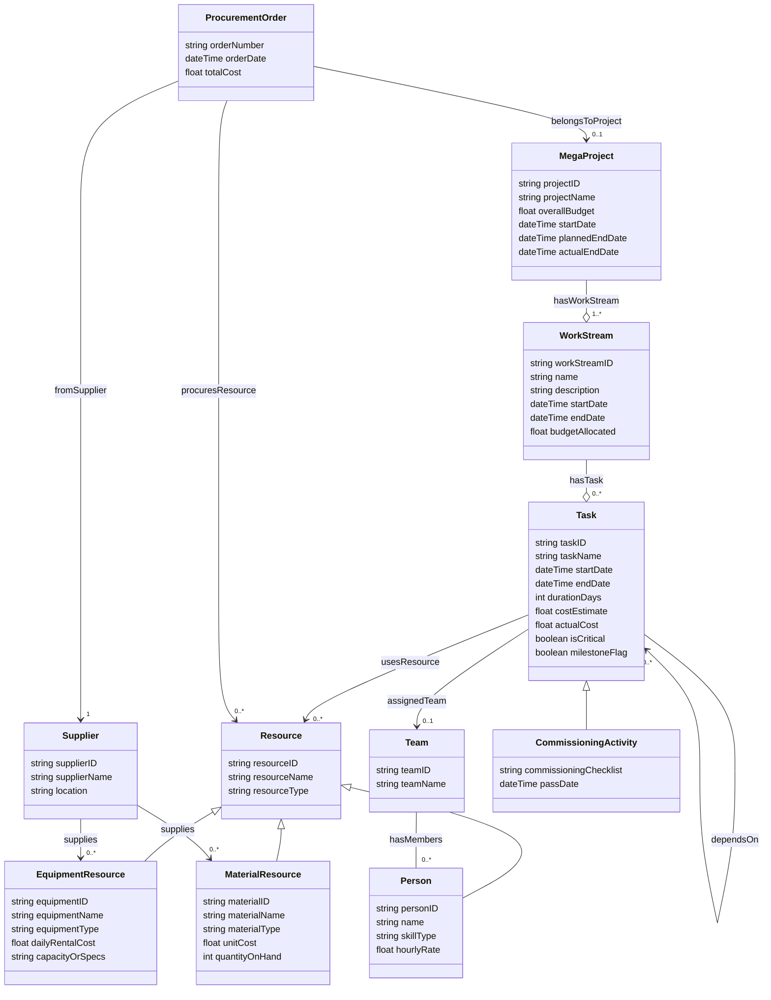

# Ontology Structure                                                    
                                                      

                                                    
---                          
                          
```pseudocode                        
Class: MegaProject            
   - projectID: string                // Unique project identifier            
   - projectName: string              // E.g., "Mega DataCenter Construction"            
   - overallBudget: float             // Total allocated budget            
   - startDate: dateTime              // Project start (must be ≤ plannedEndDate)            
   - plannedEndDate: dateTime         // Planned completion date            
   - actualEndDate: dateTime (optional) // Recorded completion, if finished            
            
   // Relationships:            
   - hasWorkStream -> WorkStream (1..*)              
     // RULE: A MegaProject must consist of one or more WorkStreams.            
              
Class: WorkStream            
   - workStreamID: string             // Unique identifier (e.g., WS-1001)            
   - name: string                     // Descriptive name (e.g., "HVAC & Cooling")            
   - description: string              // Brief details            
   - startDate: dateTime              // Must be within the MegaProject's timeframe            
   - endDate: dateTime                // Must be later than startDate and ≤ MegaProject.plannedEndDate            
   - budgetAllocated: float           // Portion of project budget            
            
   // Relationships:            
   - belongsToProject -> MegaProject (1..1)            
   - hasTask -> Task (0..*)            
   // RULE: Each WorkStream is associated with exactly one MegaProject.            
               
Class: Task            
   - taskID: string                   // Unique identifier (e.g., TK-1050)            
   - taskName: string                 // E.g., "Pour Foundation"            
   - startDate: dateTime              // Actual or scheduled start; must be ≥ WorkStream.startDate            
   - endDate: dateTime                // Must be > startDate and ideally ≤ WorkStream.endDate            
   - durationDays: int                // Computed or estimated duration            
   - costEstimate: float              // Planned cost for this task            
   - actualCost: float                // Actual cost (may update during progress)            
   - isCritical: boolean              // TRUE if on the critical path (computed from dependencies)            
   - milestoneFlag: boolean           // TRUE if task represents a project milestone            
            
   // Relationships:            
   - belongsToWorkStream -> WorkStream (0..1)              
     // RULE: Typically, a Task belongs to a single WorkStream; if not, it must reference the overall project.            
   - dependsOn -> Task (0..*)         // List of taskIDs this task depends on            
      // RULE: For any dependency, the dependent Task’s startDate must be ≥ the dependency’s endDate.            
   - usesResource -> Resource (0..*)  // Resources (Labor, Equipment, Material) assigned to the task            
   - assignedTeam -> Team (0..1)        // Optional: a dedicated team performing the task            
Class: Resource (abstract)            
   - resourceID: string               // Unique identifier            
   - resourceName: string             // Descriptive name            
   - resourceType: string             // One of: "Labor", "Equipment", "Material"            
               
Class: Person  (represents a labor resource)            
   - personID: string                 // Unique employee identifier (e.g., EMP-5001)            
   - name: string            
   - skillType: string                // E.g., "CivilEngineer", "Electrician", "ProjectManager", etc.            
   - hourlyRate: float                // Must be > 0            
   // RULE: The value for skillType must be one from a defined set (at least 35 different skills).            
               
Class: EquipmentResource (extends Resource)            
   - equipmentID: string              // Unique identifier (e.g., EQ-1001)            
   - equipmentName: string            
   - equipmentType: string            // E.g., "Crane", "ConcreteMixer", "Digital Equipment", etc.            
   - dailyRentalCost: float           // > 0            
   - capacityOrSpecs: string          // Descriptive specification (e.g., "5-ton capacity")            
   // RULE: Equipment types should cover at least 30 distinct categories.            
               
Class: MaterialResource (extends Resource)            
   - materialID: string               // Unique identifier (e.g., MAT-1001)            
   - materialName: string            
   - materialType: string             // E.g., "Concrete", "SteelBeam", "FiberOptics", etc.            
   - unitCost: float                  // > 0            
   - quantityOnHand: int              // Optional: current inventory            
   // RULE: Material types should cover at least 30 distinct categories.            
               
Class: Supplier            
   - supplierID: string               // Unique identifier (e.g., SUP-1001)            
   - supplierName: string            
   - location: string            
   - supplies -> MaterialResource or EquipmentResource (0..*)            
   // RULE: Each supplier may supply one or more resource types.            
               
Class: Team            
   - teamID: string                   // Unique identifier (e.g., TM-1001)            
   - teamName: string                 // Descriptive name (e.g., "Foundation Crew")            
   // Optionally, a team can reference a set of People (labor resources)            
               
Class: ProcurementOrder            
   - orderNumber: string              // Unique order number            
   - orderDate: dateTime              // Date when the order was placed            
   - totalCost: float                 // Total cost for the order            
   // Relationships:            
   - fromSupplier -> Supplier (1..1)            
   - procuresResource -> MaterialResource or EquipmentResource (0..*)            
   - belongsToProject -> MegaProject (optional)            
   // RULE: The orderDate must be before or concurrent with the start of tasks using these resources.            
               
Class: CommissioningActivity (extends Task)            
   - commissioningChecklist: string   // List or description of required checks            
   - passDate: dateTime (optional)      // Date when commissioning was approved            
   // RULE: Typically, commissioning activities occur after Construction is complete.            
            
                    
```                         
                  
---        
        
### Critical Path / Scheduling Logic (Derived Concept)        
        
- **Task Dependency Constraints**:          
  Each Task that depends on another must start only after the predecessor ends.          
  _Rule Example_: For each dependency D in Task T, T.startDate ≥ D.endDate.        
        
- **Critical Path Identification**:          
  A task is flagged as **critical** (isCritical = True) if it lies on the longest path (zero slack) in the dependency network.          
  _Rule Example_: A forward/backward pass scheduling algorithm computes float; tasks with float = 0 are critical.        
        
- **Resource Availability**:          
  Tasks using resources (Labor, Equipment, Material) assume the resources are available for the entire duration. (In a real system, resource leveling is applied.)        
        
---        
        
## Ontology Review        
        
This EPCC/LEMS/PMBOK Domain ontology includes:        
        
- **Project Management Constructs**: MegaProject, WorkStream, Task          
- **Resource Layers (LEMS)**: Person (Labor), EquipmentResource, MaterialResource, Supplier, Team          
- **Procurement and Commissioning**: ProcurementOrder, CommissioningActivity          
- **Dependencies & Scheduling Constraints**: Dependencies among tasks and critical path derivation          
        
All classes include **relationships** (e.g., Task belongs to WorkStream, WorkStream belongs to MegaProject) and **constraints** (e.g., temporal ordering, resource type limits, and critical path conditions).        
        
