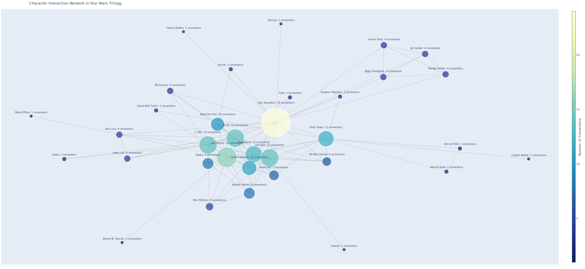

# A **Star Wars** Ontology!                    
        
             
---                
                
## Ontology Structure: Core Classes / Entities (Domain Ontology)                
                
Below is a conceptual structure, with a **pseudocode** approach.         
        
        
        
        
### SVG    
Created using the mermaid code in [Draw.io](https://app.diagrams.net) `[Arrange>Insert>Advanced>Mermaid]`
<html>         
	                 
</html>     
                
                
## Joseph Campbell's *Monomyth* or The [Hero's journey](https://en.wikipedia.org/wiki/Hero%27s_journey)            
<html>         
	                 
</html>      
                
## Data  
The [`.'data`](https://github.com/shauryashaurya/The-Silmaril/tree/main/o-1000-StarWars/data) folder carries a full timeline of all the events of the original trilogy.   
Thanks to [Wookieepedia](https://starwars.fandom.com/wiki/Main_Page).      
Also tried to model the "Luke, I am your father!" bit.   
The data has several events which can be loaded and streamed to run analysis - which let's you _play_ the movies out, explore event predicates, the whole plot line etc. etc.    


### Data Dictionary
Also carries a full [data dictionary](https://github.com/shauryashaurya/The-Silmaril/blob/main/o-1000-StarWars/star_wars_data_dictionary.md) for the generated data.
I honestly think this page can be improved. In due time, when I have more time. For now, click around, read a bit, see what you like etc. etc. :)
                
        
### Interactive Mermaid diagram

```mermaid                                                              
graph TD        
        
%% Top-down layout, ensuring no colons or pipes in labels.        
%% We now represent cardinalities in parentheses like (0-To-1), (0-To-Many), etc.        
        
%% =========================        
%% CLASSES AND DATA PROPERTIES        
%% =========================        
        
Character["Character<br>characterID<br>name<br>species<br>gender<br>affiliation<br>rank<br>forceSensitive boolean<br>starSign<br>cameoAppearance boolean"]        
Jedi["Jedi<br>lightsaberColor<br>midiChlorianCount int<br>jediRank"]        
Sith["Sith<br>darkSideLevel int<br>apprenticeOf<br>sithTitle"]        
Droid["Droid<br>modelNumber<br>primaryFunction<br>owner<br>memoryWipes int"]        
Spaceship["Spaceship<br>shipID<br>model<br>shipClass<br>speedRating float<br>hyperdriveEquipped boolean<br>uniqueName"]        
Planet["Planet<br>planetID<br>planetName<br>starSystem<br>climate<br>population long<br>affiliation<br>orbitalPeriodDays float"]        
StarSystem["StarSystem<br>systemID<br>systemName<br>coordinates"]        
Faction["Faction<br>factionID<br>name<br>leader<br>primaryGoal<br>ideology"]        
Battle["Battle<br>battleID<br>name<br>outcome<br>battleDate dateTime<br>casualties int"]        
EventNode["Event<br>eventID<br>description<br>timestamp dateTime<br>significanceLevel"]        
Weapon["Weapon<br>weaponID<br>name<br>weaponType<br>destructiveCapacity float"]        
Lightsaber["Lightsaber<br>color<br>hiltDesign"]        
ForceAbility["ForceAbility<br>abilityID<br>name<br>abilityType<br>strengthLevel float"]        
Vehicle["Vehicle<br>vehicleID<br>type<br>speed float<br>terrainType"]        
Mission["Mission<br>missionID<br>missionType<br>missionGoal<br>successRate float"]        
AllianceBase["AllianceBase<br>baseID<br>name<br>hiddenLocation boolean"]        
EmpireFacility["EmpireFacility<br>facilityID<br>name<br>securityLevel"]        
RebelAllianceMember["RebelAllianceMember<br>memberID<br>joinedDate dateTime<br>role"]        
EmpireMember["EmpireMember<br>memberID<br>joinedDate dateTime<br>rank"]        
Creature["Creature<br>creatureID<br>speciesName<br>habitat<br>dangerLevel float"]        
Technology["Technology<br>technologyID<br>techType<br>inventor<br>functionDescription"]        
Artifact["Artifact<br>artifactID<br>artifactName<br>originEra<br>isCursed boolean<br>powerLevel float"]        
Holocron["Holocron<br>holocronID<br>keeper<br>containsKnowledge"]        
SpaceStation["SpaceStation<br>stationID<br>name<br>operationalStatus"]        
DeathStar["DeathStar<br>weaponCapacity float<br>shieldStatus"]        
BountyHunter["BountyHunter<br>hunterID<br>notorietyLevel<br>pricePerHunt float<br>lethalEfficiency float"]        
Smuggler["Smuggler<br>smugglerID<br>smugglingSkill float<br>wantedStatus boolean"]        
Politician["Politician<br>politicianID<br>politicalAffiliation<br>influenceLevel float"]        
MilitaryUnit["MilitaryUnit<br>unitID<br>size int<br>deploymentStatus"]        
SimulationScenario["SimulationScenario<br>scenarioID<br>description<br>outcome"]        
Prophecy["Prophecy<br>prophecyID<br>prophecyText<br>fulfilled boolean"]        
        
%% =========================        
%% SUBCLASS HIERARCHIES (DOTTED LINES)        
%% use spaces around subClassOf to avoid parse errors        
%% =========================        
        
Jedi -. subClassOf .-> Character        
Sith -. subClassOf .-> Character        
RebelAllianceMember -. subClassOf .-> Character        
EmpireMember -. subClassOf .-> Character        
        
%% =========================        
%% DISJOINT CLASSES (DOTTED LINES)        
%% e.g., RebelAllianceMember vs EmpireMember        
%% =========================        
        
RebelAllianceMember -. disjointWith .-> EmpireMember        
        
%% =========================        
%% OBJECT PROPERTIES WITH CARDINALITIES IN PARENS        
%% =========================        
        
Character -- "member_Of (0-To-1)" --> Faction        
Character -- "leads_Faction (0-To-1)" --> Faction        
Sith -- "apprentice_To (0-To-1)" --> Character        
Jedi -- "master_Of (0-To-Many)" --> Character        
Character -- "participates_In (0-To-Many)" --> Battle        
Battle -- "located_At (0-To-1)" --> Planet        
Battle -- "triggers_Event (0-To-Many)" --> EventNode        
Droid -- "owned_By (0-To-1)" --> Character        
Spaceship -- "piloted_By (0-To-Many)" --> Character        
Planet -- "within_System (Exactly-1)" --> StarSystem        
Weapon -- "wielded_By (0-To-Many)" --> Character        
Character -- "has_Ability (0-To-Many)" --> ForceAbility        
Vehicle -- "deployed_In (0-To-Many)" --> Battle        
Mission -- "assigned_To (0-To-Many)" --> Character        
Mission -- "mission_Location (0-To-1)" --> Planet        
Faction -- "operates_Facility (0-To-Many)" --> EmpireFacility        
Faction -- "owns_Base (0-To-Many)" --> AllianceBase        
Creature -- "inhabits (0-To-1)" --> Planet        
Technology -- "invented_By (0-To-1)" --> Character        
Artifact -- "possessed_By (0-To-1)" --> Character        
SpaceStation -- "controlled_By (0-To-1)" --> Faction        
SimulationScenario -- "scenario_Includes (0-To-Many)" --> Battle        
Prophecy -- "predicts (0-To-Many)" --> EventNode        
Politician -- "influences (0-To-Many)" --> Faction        
BountyHunter -- "hunts_Target (0-To-Many)" --> Character        
Smuggler -- "allied_With (0-To-Many)" --> Character        
MilitaryUnit -- "commanded_By (0-To-1)" --> Character        
Holocron -- "guarded_By (0-To-1)" --> Jedi        
        
%% Additional expansions        
Character -- "has_Sidekick (0-To-1)" --> Character        
Faction -- "allied_With_Faction (0-To-Many)" --> Faction        
Character -- "spied_On_By (0-To-Many)" --> Droid        
Lightsaber -- "constructed_By (0-To-1)" --> Jedi        
Battle -- "incorporates_Vehicle (0-To-Many)" --> Vehicle        
Smuggler -- "hidden_In (0-To-1)" --> Spaceship        
BountyHunter -- "steals_From (0-To-Many)" --> Smuggler        
Jedi -- "studied_Holocron (0-To-Many)" --> Holocron        
Politician -- "oversees_Unit (0-To-Many)" --> MilitaryUnit        
Mission -- "protects_Artifact (0-To-Many)" --> Artifact        
        
%% =========================        
%% PROPERTY RESTRICTIONS (DOTTED LINES)        
%% e.g., short constraints or domain notes        
%% =========================        
        
Droid -. "no_Force_Ability" .-> ForceAbility        
Lightsaber -. "only_Jedi_Or_Sith" .-> Character        
Battle -. "min_Factions_2" .-> Faction        
Sith -. "apprentice_Master_Link" .-> Sith        
Jedi -. "force_Sensitive_Only" .-> Character        
         
```                                                 

                                                            
---                                  
                                  
```pseudocode                                
// ======================        
// Star Wars Ontology (Episodes 4,5,6)             
// ======================        
        
// ========== CLASSES (31) ==========        
        
Class: Character        
  - characterID: string        
  - name: string        
  - species: string        
  - gender: string        
  - affiliation: string        
  - rank: string        
  - forceSensitive: boolean        
  - starSign: string                         
  - cameoAppearance: boolean                 
        
Class: Jedi        
  - lightsaberColor: string        
  - midiChlorianCount: int        
  - jediRank: string                        
        
Class: Sith        
  - darkSideLevel: int        
  - apprenticeOf: string        
  - sithTitle: string                       
        
Class: Droid        
  - modelNumber: string        
  - primaryFunction: string        
  - owner: string        
  - memoryWipes: int                        
        
Class: Spaceship        
  - shipID: string        
  - model: string        
  - shipClass: string        
  - speedRating: float        
  - hyperdriveEquipped: boolean        
  - uniqueName: string                      
        
Class: Planet        
  - planetID: string        
  - planetName: string        
  - starSystem: string        
  - climate: string        
  - population: long        
  - affiliation: string        
  - orbitalPeriodDays: float                
        
Class: StarSystem        
  - systemID: string        
  - systemName: string        
  - coordinates: string        
        
Class: Faction        
  - factionID: string        
  - name: string        
  - leader: string        
  - primaryGoal: string        
  - ideology: string                        
        
Class: Battle        
  - battleID: string        
  - name: string        
  - outcome: string        
  - battleDate: dateTime        
  - casualties: int                         
        
Class: Event        
  - eventID: string        
  - description: string        
  - timestamp: dateTime        
  - significanceLevel: string        
        
Class: Weapon        
  - weaponID: string        
  - name: string        
  - weaponType: string        
  - destructiveCapacity: float        
        
Class: Lightsaber        
  - color: string        
  - hiltDesign: string        
        
Class: ForceAbility        
  - abilityID: string        
  - name: string        
  - abilityType: string        
  - strengthLevel: float        
        
Class: Vehicle        
  - vehicleID: string        
  - type: string        
  - speed: float        
  - terrainType: string        
        
Class: Mission        
  - missionID: string        
  - missionType: string        
  - missionGoal: string        
  - successRate: float        
        
Class: AllianceBase        
  - baseID: string        
  - name: string        
  - hiddenLocation: boolean        
        
Class: EmpireFacility        
  - facilityID: string        
  - name: string        
  - securityLevel: string        
        
Class: RebelAllianceMember        
  - memberID: string        
  - joinedDate: dateTime        
  - role: string        
        
Class: EmpireMember        
  - memberID: string        
  - joinedDate: dateTime        
  - rank: string        
        
Class: Creature        
  - creatureID: string        
  - speciesName: string        
  - habitat: string        
  - dangerLevel: float        
        
Class: Technology        
  - technologyID: string        
  - techType: string        
  - inventor: string        
  - functionDescription: string        
        
Class: Artifact        
  - artifactID: string        
  - originEra: string        
  - forceRelated: boolean        
        
Class: Holocron        
  - holocronID: string        
  - keeper: string        
  - containsKnowledge: string        
        
Class: SpaceStation        
  - stationID: string        
  - name: string        
  - operationalStatus: string        
        
Class: DeathStar        
  - weaponCapacity: float        
  - shieldStatus: string        
        
Class: BountyHunter        
  - hunterID: string        
  - notorietyLevel: string        
  - pricePerHunt: float        
  - lethalEfficiency: float                  
        
Class: Smuggler        
  - smugglerID: string        
  - smugglingSkill: float        
  - wantedStatus: boolean        
        
Class: Politician        
  - politicianID: string        
  - politicalAffiliation: string        
  - influenceLevel: float        
        
Class: MilitaryUnit        
  - unitID: string        
  - size: int        
  - deploymentStatus: string        
        
Class: SimulationScenario        
  - scenarioID: string        
  - description: string        
  - outcome: string        
        
Class: Prophecy        
  - prophecyID: string        
  - prophecyText: string        
  - fulfilled: boolean        
        
// ========== OBJECT PROPERTIES ==========        
        
// EXISTING RELATIONSHIPS:        
Relationship: memberOf (Character → Faction, 0..1)        
Relationship: leadsFaction (Character → Faction, 0..1)        
Relationship: apprenticeTo (Sith → Character, 0..1)        
Relationship: masterOf (Jedi → Character, 0..*)        
Relationship: participatesIn (Character → Battle, 0..*)        
Relationship: locatedAt (Battle → Planet, 0..1)        
Relationship: triggersEvent (Battle → Event, 0..*)        
Relationship: ownedBy (Droid → Character, 0..1)        
Relationship: pilotedBy (Spaceship → Character, 0..*)        
Relationship: withinSystem (Planet → StarSystem, 1..1)        
Relationship: wieldedBy (Weapon → Character, 0..*)        
Relationship: hasAbility (Character → ForceAbility, 0..*)        
Relationship: deployedIn (Vehicle → Battle, 0..*)        
Relationship: assignedTo (Mission → Character, 0..*)        
Relationship: missionLocation (Mission → Planet, 0..1)        
Relationship: operatesFacility (Faction → EmpireFacility, 0..*)        
Relationship: ownsBase (Faction → AllianceBase, 0..*)        
Relationship: inhabits (Creature → Planet, 0..1)        
Relationship: inventedBy (Technology → Character, 0..1)        
Relationship: possessedBy (Artifact → Character, 0..1)        
Relationship: controlledBy (SpaceStation → Faction, 0..1)        
Relationship: scenarioIncludes (SimulationScenario → Battle, 0..*)        
Relationship: predicts (Prophecy → Event, 0..*)        
Relationship: influences (Politician → Faction, 0..*)        
Relationship: huntsTarget (BountyHunter → Character, 0..*)        
Relationship: alliedWith (Smuggler → Character, 0..*)        
Relationship: commandedBy (MilitaryUnit → Character, 0..1)        
Relationship: guardedBy (Holocron → Jedi, 0..1)        
        
// MOAR RELATIONSHIPS....MWAAHAHAHA!!!                                
Relationship: hasSidekick (Character → Character, 0..1)                                
Relationship: alliedWithFaction (Faction → Faction, 0..*)                                
Relationship: spiedOnBy (Character → Droid, 0..*)                                
Relationship: constructedBy (Lightsaber → Jedi, 0..1)                                
Relationship: incorporatesVehicle (Battle → Vehicle, 0..*)                                
Relationship: hiddenIn (Smuggler → Spaceship, 0..1)                                
Relationship: stealsFrom (BountyHunter → Smuggler, 0..*)                                
Relationship: studiedHolocron (Jedi → Holocron, 0..*)                                
Relationship: overseesUnit (Politician → MilitaryUnit, 0..*)                                
Relationship: protectsArtifact (Mission → Artifact, 0..*)                                
                                
// ========== RULES & CONSTRAINTS ==========                                
                                
// 1) Subclass constraints:                                
   // Jedi and Sith are subclasses of Character                                
   // => implies Jedi, Sith must also have data properties from Character                                
                                
// 2) Droid cannot have ForceAbility:                                
   // i.e., if "X hasAbility Y" then X cannot be of type Droid                                
                                
// 3) Only Jedi or Sith may have Lightsaber:                                
   // If "WieldedBy(Weapon -> Character)" and Weapon is Lightsaber,                                
   // then Character must be instanceOf(Jedi or Sith).                                
                                
// 4) Each Battle must have at least two Factions involved:                                
   // i.e. (Battle -> factionParticipants) >= 2 in the story sense                                
   // Implementation: "participatesIn" from at least two distinct Factions                                
                                
// 5) A Character can be either RebelAllianceMember or EmpireMember, but not both:                                
   // Disjointness constraint for RebelAllianceMember vs. EmpireMember                                
                                
// 6) If an apprenticeTo(Sith -> Character), that Character must be a Sith or a MasterSith:                                
   // i.e., the "apprenticeTo" references a master who is presumably also a Sith or an advanced Dark Side user                                
                                
// 7) If "Character.forceSensitive = true" => (Character is Jedi or Sith).                                
   // Another approach: only Jedi or Sith can have "forceSensitive = true"                                
                                
// 8) If "spaceship.hyperdriveEquipped = false," it cannot "pilotedBy" any character who travels interstellar:                                
   // This is a domain constraint: a sublight-only ship might be restricted.                                 
   // Real logic: "We do not allow Missions to plan hyperdrive routes if spaceship hyperdriveEquipped=false."                                
                                
// 9) If "Battle.outcome = 'AllianceVictory'," then at least one participating faction must be "Rebel Alliance."                                
   // domain logic for storyline                                
                                
//10) If "Sith.darkSideLevel > 80," then "Sith.sithTitle" must exist (e.g., "Darth" or "Dark Lord").                                
                                        
// 11) "BountyHunter.lethalEfficiency" must be > 0 if "notorietyLevel" is not 'novice'                                 
   // minimal domain logic                                
                                
// 12) "Planet.orbitalPeriodDays < 1000" if "planetName != 'Tatooine'"                                 
   // e.g., fictional logic for local system                                
                                
// 13) "Battle.casualties > 0" if "Battle.outcome = 'EmpireVictory'"                                
                                
// 14) If "Faction.ideology = 'Sith Doctrine'," must have "leader" referencing a known Sith                                
                                
// 15) "Mission.successRate <= 100.0"                                 
   // typical numeric constraint                                
                               
```                        
                  
# Playing with the ontology                
                
```python                
// Character instances                
Character darth_vader = {                
  characterID: "char_001",                
  name: "Darth Vader",                
  species: "Human",                
  gender: "Male",                
  affiliation: "Galactic Empire",                
  rank: "Supreme Commander",                
  forceSensitive: true,                
  starSign: "Unknown",                
  cameoAppearance: false                
}                
                
Sith darth_vader_sith = {                
  // Inherits from Character darth_vader                
  darkSideLevel: 95,                
  apprenticeOf: "Emperor Palpatine",                
  sithTitle: "Darth"                
}                
                
Character luke_skywalker = {                
  characterID: "char_002",                
  name: "Luke Skywalker",                
  species: "Human",                
  gender: "Male",                
  affiliation: "Rebel Alliance",                
  rank: "Commander",                
  forceSensitive: true,                
  starSign: "Unknown",                
  cameoAppearance: false                
}                
                
Jedi luke_skywalker_jedi = {                
  // Inherits from Character luke_skywalker                
  lightsaberColor: "green",                
  midiChlorianCount: 20000,                
  jediRank: "Padawan"                
}                
                
// The revelation event                
Event vader_revelation = {                
  eventID: "event_001",                
  description: "Darth Vader reveals to Luke Skywalker that he is his father",                
  timestamp: "3 ABY",                
  significanceLevel: "High"                
}                
                
// Creating a new relationship not explicitly defined in the ontology                
// This could be added to the object properties section                
Relationship: biologicalParentOf (Character → Character, 0..*)                
                
// Instance of the relationship (spoiler alert!)        
// Vader: "Luke, I am your Father..."
// Luke Skywalker: "Nooooooo.....!!!"        
biologicalParentOf(darth_vader, luke_skywalker)               
```                   
                
                    
                    
### I just thought this was cool                    
                    
But it is still under development - eventually I want to be able to run scenario simulations for the Star Wars universe.

## Citation        
Inspired by [Dorian Smiley's The Star Wars Stack](https://github.com/doriansmiley/TheStarWarsStack) idea, which in turn is inspired by the ["Ticker Symbol: YOU" (channel) video on YouTube](https://www.youtube.com/watch?v=Rq3JjUUgTBI&t=924s)          
My attempt is to just try and craft an almost simple ontology, not the full blown project, and slowly grow it so it can run simulations and scenarios on the fictional timeline of Star Wars.           
.        