# A **Lord Of The Rings** Ontology!            
        
...because while we are talking Palantir, why not a proper LOTR Ontology :)
        
---        
        
## Ontology Structure: Core Classes / Entities (Domain Ontology)        
        
Below is a conceptual structure, with a **pseudocode** approach. 

                                                      
# Ontology Structure                                                        

```mermaid                                                              
graph TD        
        
%% Top-down layout. We have 35 classes total, 25 from the original LotR ontology plus 10 new ones.        
%% We'll keep the same labeling approach: no colons or pipes, cardinalities in parentheses, underscores in relationship names.        
%% We'll add new data properties and new object properties, plus revised or new constraints.        
        
%% =========================        
%% CLASSES WITH DATA PROPERTIES        
%% =========================        
        
MiddleEarth["MiddleEarth<br>worldID<br>ageCount int<br>currentAge int<br>ageName<br>darkInfluenceLevel float"]        
Region["Region<br>regionID<br>regionName<br>climateType<br>notableLandmarks<br>localPopulation long"]        
Race["Race<br>raceID<br>raceName<br>averageLifespan int<br>languageFamily"]        
Kingdom["Kingdom<br>kingdomID<br>kingdomName<br>foundingYear int<br>leadershipStructure<br>allianceStatus"]        
Person["Person<br>personID<br>personName<br>gender<br>age int<br>isRingBearer boolean<br>alignment<br>fateStatus"]        
Hobbit["Hobbit<br>hobbitFamilyName<br>pipeWeedPreference<br>stealthSkill float"]        
Elf["Elf<br>elfTitle<br>bowSkill float<br>immortalYearsLived int"]        
Dwarf["Dwarf<br>dwarfClan<br>miningSkill float<br>beardLength float"]        
Man["Man<br>realmAllegiance<br>swordSkill float<br>lifespanVariance float"]        
Wizard["Wizard<br>wizardOrder<br>staffPowerLevel float<br>robeColor"]        
Orc["Orc<br>orcTribe<br>aggressionLevel float<br>dayLightWeakness boolean"]        
Artifact["Artifact<br>artifactID<br>artifactName<br>originEra<br>isCursed boolean<br>powerLevel float"]        
Weapon["Weapon<br>weaponID<br>weaponName<br>weaponType<br>forgingSkillRequired float<br>enchantmentLevel float"]        
Ring["Ring<br>ringID<br>ringName<br>ringPowerType<br>corruptionIndex float<br>forgingAge int<br>isOneRing boolean"]        
Fellowship["Fellowship<br>fellowshipID<br>name<br>missionObjective<br>formationDate dateTime"]        
LocationNode["Location<br>locationID<br>locationName<br>terrainType<br>magicalAuraLevel float<br>riskFactor float"]        
Journey["Journey<br>journeyID<br>journeyName<br>distanceKm float<br>startedDate dateTime<br>endedDate dateTime"]        
Battle["Battle<br>battleID<br>battleName<br>outcome<br>battleDate dateTime<br>casualtyCount int<br>durationHours float"]        
Alliance["Alliance<br>allianceID<br>allianceName<br>primaryGoal<br>strengthRating float"]        
Beast["Beast<br>beastID<br>beastName<br>beastType<br>hostilityLevel float<br>tamable boolean"]        
AncientProphecy["AncientProphecy<br>prophecyID<br>prophecyText<br>dateForetold dateTime<br>prophecyFulfilled boolean<br>seerName"]        
DarkFortress["DarkFortress<br>fortressID<br>fortressName<br>defenseLevel float<br>capturedStatus boolean<br>overshadowingEvil float"]        
Army["Army<br>armyID<br>armyName<br>totalUnits int<br>moraleLevel float<br>bannerSymbol"]        
MagicSpell["MagicSpell<br>spellID<br>spellName<br>spellType<br>manaCost float<br>effectPower float"]        
Council["Council<br>councilID<br>councilName<br>purpose<br>convenedDate dateTime<br>secrecyLevel float"]        
Valar["Valar<br>valarID<br>valarName<br>domainOfPower<br>cosmicRank float"]        
Maiar["Maiar<br>maiarID<br>maiarName<br>maiarOrder<br>spiritualPotency float"]        
Rune["Rune<br>runeID<br>runeScript<br>mysticValue float<br>originAge int"]        
Language["Language<br>languageID<br>languageName<br>writingSystem<br>complexityLevel float"]        
Silmaril["Silmaril<br>silmarilID<br>radianceLevel float<br>creationAge int<br>fateStatus<br>holyAura boolean"]        
Numenorean["Numenorean<br>lineagePurity float<br>numenorOriginYear int<br>royalBlood boolean"]        
Gondorian["Gondorian<br>houseName<br>militaryTradition float<br>numenorDescent boolean"]        
RuneSmith["RuneSmith<br>smithID<br>smithName<br>masteryLevel float<br>specializationRuneType"]        
ElvenScript["ElvenScript<br>scriptID<br>scriptStyle<br>graceFactor float<br>rarityIndex float"]        
Palantir["Palantir<br>palantirID<br>seeingPower float<br>corruptingInfluence float<br>lostStatus boolean"]        
        
%% =========================        
%% SUBCLASS HIERARCHIES (DOTTED LINES)        
%% Using spaces around subClassOf        
%% =========================        
        
Hobbit -. subClassOf .-> Person        
Elf -. subClassOf .-> Person        
Dwarf -. subClassOf .-> Person        
Man -. subClassOf .-> Person        
Wizard -. subClassOf .-> Person        
Orc -. subClassOf .-> Person        
        
%% e.g., Numenorean, Gondorian can subClassOf Man        
Numenorean -. subClassOf .-> Man        
Gondorian -. subClassOf .-> Man        
        
Valar -. subClassOf .-> Race        
Maiar -. subClassOf .-> Race        
        
%% Additional script relation        
ElvenScript -. subClassOf .-> Language        
        
%% =========================        
%% DISJOINT CLASSES (DOTTED LINES)        
%% Example: Hobbit disjointWith Orc        
%% =========================        
        
Hobbit -. disjointWith .-> Orc        
        
%% =========================        
%% OBJECT PROPERTIES        
%% Using underscores, cardinalities in parentheses        
%% =========================        
        
MiddleEarth -- "contains_Region (1-To-Many)" --> Region        
MiddleEarth -- "fosters_Race (0-To-Many)" --> Race        
        
Kingdom -- "situated_In (0-To-1)" --> Region        
Person -- "belongs_To_Kingdom (0-To-1)" --> Kingdom        
Person -- "part_Of_Fellowship (0-To-Many)" --> Fellowship        
Person -- "occupant_Of (0-To-1)" --> LocationNode        
Person -- "has_Weapon (0-To-Many)" --> Weapon        
Person -- "has_Artifact (0-To-Many)" --> Artifact        
Person -- "wields_Ring (0-To-1)" --> Ring        
Person -- "belongs_To_Army (0-To-Many)" --> Army        
Fellowship -- "organizes_Journey (0-To-Many)" --> Journey        
Mission -- "mission_Involves (0-To-Many)" --> Fellowship        
Journey -- "covers_Location (0-To-Many)" --> LocationNode        
Journey -- "final_Destination (0-To-1)" --> LocationNode        
Army -- "fought_In (0-To-Many)" --> Battle        
Battle -- "took_Place_At (0-To-1)" --> LocationNode        
Alliance -- "allied_With (0-To-Many)" --> Kingdom        
Beast -- "tamed_By (0-To-1)" --> Person        
AncientProphecy -- "prophecy_Concerns (0-To-Many)" --> Person        
DarkFortress -- "guarded_By_Orcs (0-To-Many)" --> Orc        
DarkFortress -- "besieged_By (0-To-Many)" --> Army        
MagicSpell -- "cast_By (0-To-1)" --> Wizard        
MagicSpell -- "cast_On (0-To-Many)" --> Person        
Council -- "council_Attended_By (0-To-Many)" --> Race        
Council -- "invites_Kingdom (0-To-Many)" --> Kingdom        
Ring -- "ring_Origin (0-To-1)" --> Kingdom        
AncientProphecy -- "prophecy_Tested_In (0-To-Many)" --> Battle        
DarkFortress -- "fortress_In_Alliance (0-To-1)" --> Alliance        
RuneSmith -- "smiths_Rune (0-To-Many)" --> Rune        
RuneSmith -- "smiths_Weapon (0-To-Many)" --> Weapon        
Rune -- "bound_To_Language (0-To-1)" --> Language        
Silmaril -- "kept_In (0-To-1)" --> LocationNode        
Silmaril -- "claimed_By (0-To-Many)" --> Person        
Palantir -- "used_By (0-To-Many)" --> Person        
Palantir -- "enchanted_By (0-To-1)" --> Maiar        
        
Numenorean -- "has_Legacy (0-To-Many)" --> Artifact        
Gondorian -- "pledges_To (0-To-1)" --> Kingdom        
ElvenScript -- "script_BasedOn (0-To-1)" --> Language        
        
%% =========================        
%% PROPERTY RESTRICTIONS (DOTTED LINES)        
%% e.g. short constraints        
%% =========================        
        
Dwarf -. "beard_Required" .-> Dwarf        
Ring -. "only_One_Ring" .-> Ring        
Hobbit -. "stealth_Trait" .-> Person        
Wizard -. "staff_Power_Req" .-> MagicSpell        
DarkFortress -. "overshadow_Limit" .-> Orc        
Valar -. "cosmic_Influence" .-> MiddleEarth        
Silmaril -. "holy_Object_Only" .-> Elf        
Rune -. "requires_RuneSmith" .-> RuneSmith        
Palantir -. "prone_To_Corruption" .-> Maiar        
Numenorean -. "mortal_Yet_Special" .-> Man        
        
         
```                                                 
                                                              

                                                            
---                                  
                                  
```pseudocode                                
Class: MiddleEarth        
  - worldID: string        
  - ageCount: int        
  - currentAge: int        
  - ageName: string        
  - darkInfluenceLevel: float        
        
Class: Region        
  - regionID: string        
  - regionName: string        
  - climateType: string        
  - notableLandmarks: string        
  - localPopulation: long        
        
Class: Race        
  - raceID: string        
  - raceName: string        
  - averageLifespan: int        
  - languageFamily: string        
        
Class: Kingdom        
  - kingdomID: string        
  - kingdomName: string        
  - foundingYear: int        
  - leadershipStructure: string        
  - allianceStatus: string        
        
Class: Person        
  - personID: string        
  - personName: string        
  - gender: string        
  - age: int        
  - isRingBearer: boolean        
  - alignment: string        
  - fateStatus: string        
        
Class: Hobbit        
  - hobbitFamilyName: string        
  - pipeWeedPreference: string        
  - stealthSkill: float        
        
Class: Elf        
  - elfTitle: string        
  - bowSkill: float        
  - immortalYearsLived: int        
        
Class: Dwarf        
  - dwarfClan: string        
  - miningSkill: float        
  - beardLength: float        
        
Class: Man        
  - realmAllegiance: string        
  - swordSkill: float        
  - lifespanVariance: float        
        
Class: Wizard        
  - wizardOrder: string        
  - staffPowerLevel: float        
  - robeColor: string        
        
Class: Orc        
  - orcTribe: string        
  - aggressionLevel: float        
  - dayLightWeakness: boolean        
        
Class: Artifact        
  - artifactID: string        
  - artifactName: string        
  - originEra: string        
  - isCursed: boolean        
  - powerLevel: float        
        
Class: Weapon        
  - weaponID: string        
  - weaponName: string        
  - weaponType: string        
  - forgingSkillRequired: float        
  - enchantmentLevel: float        
        
Class: Ring        
  - ringID: string        
  - ringName: string        
  - ringPowerType: string        
  - corruptionIndex: float        
  - forgingAge: int        
  - isOneRing: boolean        
        
Class: Fellowship        
  - fellowshipID: string        
  - name: string        
  - missionObjective: string        
  - formationDate: dateTime        
        
Class: Location        
  - locationID: string        
  - locationName: string        
  - terrainType: string        
  - magicalAuraLevel: float        
  - riskFactor: float        
        
Class: Journey        
  - journeyID: string        
  - journeyName: string        
  - distanceKm: float        
  - startedDate: dateTime        
  - endedDate: dateTime        
        
Class: Battle        
  - battleID: string        
  - battleName: string        
  - outcome: string        
  - battleDate: dateTime        
  - casualtyCount: int        
  - durationHours: float        
        
Class: Alliance        
  - allianceID: string        
  - allianceName: string        
  - primaryGoal: string        
  - strengthRating: float        
        
Class: Beast        
  - beastID: string        
  - beastName: string        
  - beastType: string        
  - hostilityLevel: float        
  - tamable: boolean        
        
Class: AncientProphecy        
  - prophecyID: string        
  - prophecyText: string        
  - dateForetold: dateTime        
  - prophecyFulfilled: boolean        
  - seerName: string        
        
Class: DarkFortress        
  - fortressID: string        
  - fortressName: string        
  - defenseLevel: float        
  - capturedStatus: boolean        
  - overshadowingEvil: float        
        
Class: Army        
  - armyID: string        
  - armyName: string        
  - totalUnits: int        
  - moraleLevel: float        
  - bannerSymbol: string        
        
Class: MagicSpell        
  - spellID: string        
  - spellName: string        
  - spellType: string        
  - manaCost: float        
  - effectPower: float        
        
Class: Council        
  - councilID: string        
  - councilName: string        
  - purpose: string        
  - convenedDate: dateTime        
  - secrecyLevel: float        
        
Class: Valar        
  - valarID: string        
  - valarName: string        
  - domainOfPower: string        
  - cosmicRank: float        
        
Class: Maiar        
  - maiarID: string        
  - maiarName: string        
  - maiarOrder: string        
  - spiritualPotency: float        
        
Class: Rune        
  - runeID: string        
  - runeScript: string        
  - mysticValue: float        
  - originAge: int        
        
Class: Language        
  - languageID: string        
  - languageName: string        
  - writingSystem: string        
  - complexityLevel: float        
        
Class: Silmaril        
  - silmarilID: string        
  - radianceLevel: float        
  - creationAge: int        
  - fateStatus: string        
  - holyAura: boolean        
        
Class: Numenorean        
  - lineagePurity: float        
  - numenorOriginYear: int        
  - royalBlood: boolean        
        
Class: Gondorian        
  - houseName: string        
  - militaryTradition: float        
  - numenorDescent: boolean        
        
Class: RuneSmith        
  - smithID: string        
  - smithName: string        
  - masteryLevel: float        
  - specializationRuneType: string        
        
Class: ElvenScript        
  - scriptID: string        
  - scriptStyle: string        
  - graceFactor: float        
  - rarityIndex: float        
        
Class: Palantir        
  - palantirID: string        
  - seeingPower: float        
  - corruptingInfluence: float        
  - lostStatus: boolean        
        
// Using the idea that certain classes are specialized sub-classes        
        
// Race sub-classes:        
Valar subClassOf Race        
Maiar subClassOf Race        
        
// Person sub-classes:        
Hobbit subClassOf Person        
Elf subClassOf Person        
Dwarf subClassOf Person        
Man subClassOf Person        
Wizard subClassOf Person        
Orc subClassOf Person        
        
// Additional sub-classes of Man:        
Numenorean subClassOf Man        
Gondorian subClassOf Man        
        
// ElvenScript subClassOf Language        
ElvenScript subClassOf Language        
        
Hobbit disjointWith Orc        
// Could add more disjoint sets if desired        
        
        
// ========== OBJECT PROPERTIES ==========        
// Format: Domain --> propertyName (cardinality) --> Range        
        
MiddleEarth --> contains_Region (1-To-Many) --> Region        
MiddleEarth --> fosters_Race (0-To-Many) --> Race        
        
Kingdom --> situated_In (0-To-1) --> Region        
Person --> belongs_To_Kingdom (0-To-1) --> Kingdom        
Person --> part_Of_Fellowship (0-To-Many) --> Fellowship        
Person --> occupant_Of (0-To-1) --> Location        
Person --> has_Weapon (0-To-Many) --> Weapon        
Person --> has_Artifact (0-To-Many) --> Artifact        
Person --> wields_Ring (0-To-1) --> Ring        
Person --> belongs_To_Army (0-To-Many) --> Army        
        
Fellowship --> organizes_Journey (0-To-Many) --> Journey        
Mission --> mission_Involves (0-To-Many) --> Fellowship        
Journey --> covers_Location (0-To-Many) --> Location        
Journey --> final_Destination (0-To-1) --> Location        
        
Army --> fought_In (0-To-Many) --> Battle        
Battle --> took_Place_At (0-To-1) --> Location        
Alliance --> allied_With (0-To-Many) --> Kingdom        
Beast --> tamed_By (0-To-1) --> Person        
AncientProphecy --> prophecy_Concerns (0-To-Many) --> Person        
DarkFortress --> guarded_By_Orcs (0-To-Many) --> Orc        
DarkFortress --> besieged_By (0-To-Many) --> Army        
MagicSpell --> cast_By (0-To-1) --> Wizard        
MagicSpell --> cast_On (0-To-Many) --> Person        
Council --> council_Attended_By (0-To-Many) --> Race        
Council --> invites_Kingdom (0-To-Many) --> Kingdom        
Ring --> ring_Origin (0-To-1) --> Kingdom        
AncientProphecy --> prophecy_Tested_In (0-To-Many) --> Battle        
DarkFortress --> fortress_In_Alliance (0-To-1) --> Alliance        
        
RuneSmith --> smiths_Rune (0-To-Many) --> Rune        
RuneSmith --> smiths_Weapon (0-To-Many) --> Weapon        
Rune --> bound_To_Language (0-To-1) --> Language        
Silmaril --> kept_In (0-To-1) --> Location        
Silmaril --> claimed_By (0-To-Many) --> Person        
Palantir --> used_By (0-To-Many) --> Person        
Palantir --> enchanted_By (0-To-1) --> Maiar        
        
Numenorean --> has_Legacy (0-To-Many) --> Artifact        
Gondorian --> pledges_To (0-To-1) --> Kingdom        
ElvenScript --> script_BasedOn (0-To-1) --> Language        
        
// ========== RULES & CONSTRAINTS ==========        
// 1. If Ring.isOneRing = true, there can only be exactly one such instance in the domain.        
// 2. If Wizard.staffPowerLevel > 50, staffColor must be "White" or "Grey" (example).        
// 3. Numenorean => must also be "Man" sub-class, typically a domain constraint.        
// 4. Dwarf must have beardLength >= 10.0 if male (domain flavor).        
// 5. If Silmaril.holyAura = true => can only be possessed_By (0-To-1) Elf or Maiar or Valar        
// 6. If Beast.tamable = true => "tamed_By" must reference a Person with "alignment != Evil" (example domain rule).        
// 7. If AncientProphecy.prophecyFulfilled = true => prophecy_Tested_In must have at least one "Battle" that ended "Victory" for Good side        
// 8. If Palantir.corruptingInfluence > 50 => used_By must not exceed 1 "Person" at a time (monopoly effect).        
// 9. If RuneSmith.smiths_Rune => that Rune must have "originAge >= Third Age" or domain logic for new runes        
// 10. If ElvenScript.script_BasedOn => the base Language must have "complexityLevel > 5.0" to reflect advanced scripts        
// 11. "Valar.cosmicRank > 80 => domainOfPower must be unique among all Valar"        
// 12. "Maiar.spiritualPotency < 100 => can be corrupted?" (example logic, not strictly enumerated).        
// 13. Man with realmAllegiance "Gondor" => can also be sub-class "Gondorian" or "Numenorean" if domain criteria met        
// 14. If "DarkFortress.defenseLevel > 75 => overshadowingEvil >= 50" domain correlation        
// 15. "Army.moraleLevel < 20 => cannot fight in more than 2 battles at once" domain concurrency logic        
        
```        
---        
        
```pseudocode           
// ========== Not fun enuf, let's add/refine more OBJECT PROPERTIES ==========        
        
// Core, referencing classes:        
        
// Middle-earth structure        
Relationship: containsRegion (MiddleEarth → Region, 1..*)        
Relationship: fostersRace (MiddleEarth → Race, 0..*)        
        
// Race & Subtypes        
Relationship: isHobbitOf (Hobbit → Race, 1..1)        
Relationship: isElfOf (Elf → Race, 1..1)        
Relationship: isDwarfOf (Dwarf → Race, 1..1)        
Relationship: isManOf (Man → Race, 1..1)        
Relationship: isWizardOf (Wizard → Race, 1..1)        
Relationship: isOrcOf (Orc → Race, 1..1)        
        
// Kingdom & Region        
Relationship: situatedIn (Kingdom → Region, 0..1)        
        
// Person relationships        
Relationship: belongsToKingdom (Person → Kingdom, 0..1)        
Relationship: partOfFellowship (Person → Fellowship, 0..*)        
Relationship: occupantOf (Person → Location, 0..1)        
Relationship: hasWeapon (Person → Weapon, 0..*)        
Relationship: hasArtifact (Person → Artifact, 0..*)        
Relationship: wieldsRing (Person → Ring, 0..1)        
Relationship: belongsToArmy (Person → Army, 0..*)        
        
// Fellowship, Journeys, Missions        
Relationship: organizesJourney (Fellowship → Journey, 0..*)        
Relationship: missionInvolves (Mission → Fellowship, 0..*)        
        
// Places & Journeys        
Relationship: coversLocation (Journey → Location, 0..*)        
Relationship: finalDestination (Journey → Location, 0..1)        
        
// Battles & Armies        
Relationship: foughtIn (Army → Battle, 0..*)        
Relationship: tookPlaceAt (Battle → Location, 0..1)        
        
// Alliances & Kingdoms        
Relationship: alliedWith (Alliance → Kingdom, 0..*)        
        
// Beasts & People        
Relationship: tamedBy (Beast → Person, 0..1)        
        
// Ancient Prophecy & People        
Relationship: prophecyConcerns (AncientProphecy → Person, 0..*)        
        
// DarkFortress & Orc/Man        
Relationship: guardedByOrcs (DarkFortress → Orc, 0..*)        
Relationship: besiegedBy (DarkFortress → Army, 0..*)        
        
// MagicSpell & Wizard        
Relationship: castBy (MagicSpell → Wizard, 0..1)        
Relationship: castOn (MagicSpell → Person, 0..*)        
        
// Council & Race/Kingdom        
Relationship: councilAttendedBy (Council → Race, 0..*)        
Relationship: invitesKingdom (Council → Kingdom, 0..*)        
        
// Additional new relationships (to ensure complexity):        
Relationship: oathBound (Person → Person, 0..*)              
  // E.g., person swears an oath to another        
        
Relationship: huntsBeast (Person → Beast, 0..*)              
  // e.g., specialized hunts        
        
Relationship: ringOrigin (Ring → Kingdom, 0..1)              
  // ring originally forged or discovered in a certain kingdom        
        
Relationship: prophecyTestedIn (AncientProphecy → Battle, 0..*)         
  // some battles might test the prophecy's correctness        
        
Relationship: fortressInAlliance (DarkFortress → Alliance, 0..1)        
  // a fortress might be part of an allied domain, or forcibly controlled        
        
// ========== expand and review some of the RULES & CONSTRAINTS ==========        
        
// 1) Subclass constraints for the "Race" subtypes:        
   // "Hobbit, Elf, Dwarf, Man, Wizard, Orc" are sub-classes of "Person"?         
   // Or we have "Person" as generic.         
   // We'll assume "Hobbit -> Person" etc.         
   // If so, a hobbit inherits Person data properties.         
   // Implementation detail:  they are bridging or subtyping approach.        
        
// 2) If "Ring.isOneRing = true", there can be only one such instance in the entire domain.        
   // Domain logic: Only one "One Ring."        
        
// 3) "Wizard.staffPowerLevel > 0.0" if "Wizard" is active         
   // e.g., a retired wizard might have staffPowerLevel=0 or no staff?        
        
// 4) "Person.isRingBearer = true" => "Person" cannot hold more than 1 ring at a time        
   // domain logic. Also can define if they have 'wieldsRing -> ringID' is singular.        
        
// 5) "DarkFortress.defenseLevel > 70" => overshadowingEvil >= 50        
   // domain correlation        
        
// 6) "Orc.aggressionLevel > 5.0" => dayLightWeakness=true        
   // simplistic domain rule        
        
// 7) If "Battle.outcome = 'Victory'" => casualtyCount > 0 or some Faction must have "strengthRating > 50."        
        
// 8) Each "Fellowship" must have at least 2 distinct Races among its members         
   // e.g. hobbits + men + dwarves, etc.        
        
// 9) "MagicSpell.manaCost <= (Wizard.staffPowerLevel * 10)"         
   // e.g., the wizard must have enough staff power to cast high mana spells.        
        
// 10) "AncientProphecy.prophecyFulfilled = true" => must reference at least one "Battle" or "Journey" that brought about fulfillment        
        
// 11) "Kingdom.allianceStatus != 'Allied'" => that kingdom not recognized in 'Alliance' ???        
        
// 12) "Elf.bowSkill < 0" not allowed, skill can't be negative        
   // domain numeric constraint        
        
// 13) "Hobbit.pipeWeedPreference" must not be empty if hobbit is an adult         
   // domain fun logic        
        
// 14) If "Army.moraleLevel < 20" => can't "foughtIn" more than 1 "Battle" concurrently         
   // domain concurrency logic        
        
// 15) If "Creature.beastType='Great Eagle'," must have "hostilityLevel < 5"         
   // E.g., eagles are not typically extremely hostile        
        
// (Keep including additional domain constraints as needed for storyline consistency)        
        
                 
```  
            
### I just thought this was cool            
            
But it is still under development - eventually I want to be able to run scenario simulations for this one too, just like the Star Wars universe.    
**Update**:   
Just worked on building data for the Star Wars Trilogy - my brain is fried.    
As of now this is going to be frozen.    
Unless you, dear ontology enthusiast want to submit a PR. :)
