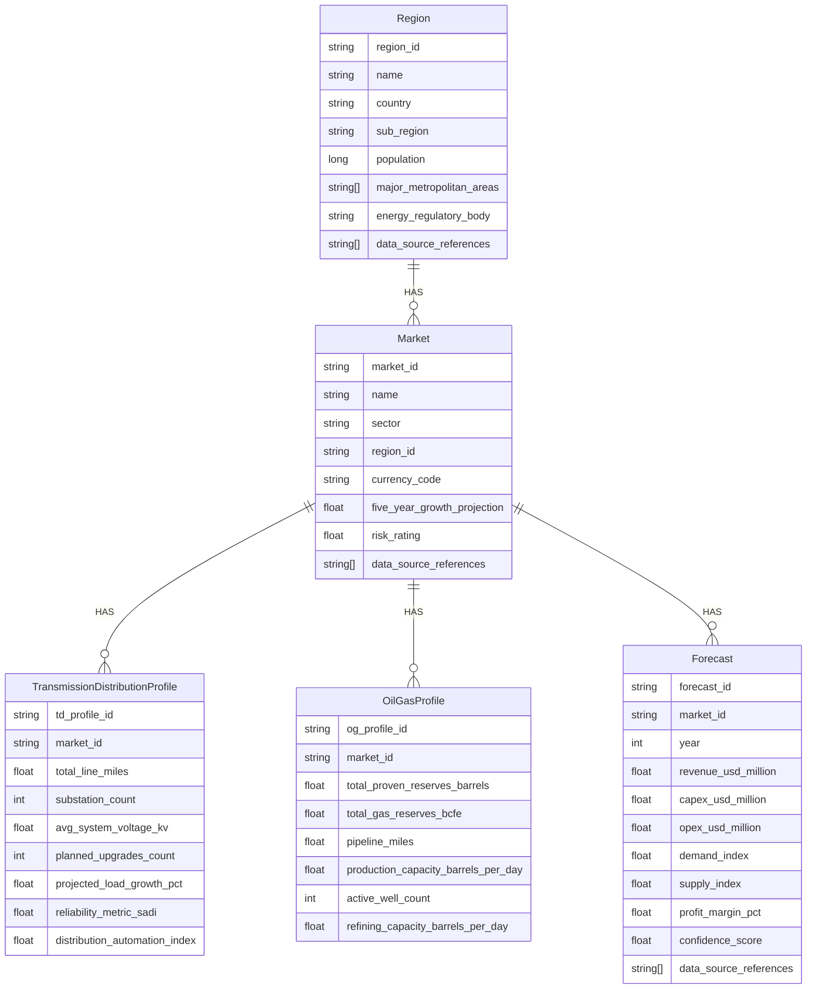
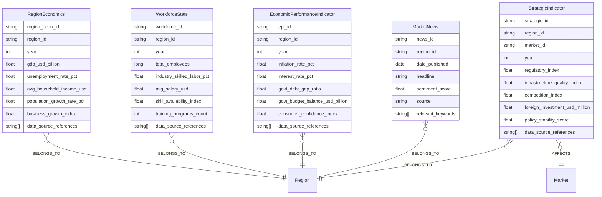

# Ontology #22 - Energy Markets Analysis                                           
                                 
Here we are focussed on building ontologies to analyse the markets from a EPCC Transmission and Distribution business unit as well as Oil and Gas buisiness unit's perspective. We want to enable the respective teams to explore scenarios and build strategies for investments.
---

## 1. EnergyMarketForecast Ontology

### **Pseudocode**

```pseudocode
Ontology EnergyMarketForecast {

  Entity Region {
    Attributes:
      - region_id: String
      - name: String
      - country: String
      - sub_region: String
      - population: Long
      - major_metropolitan_areas: List<String>
      - energy_regulatory_body: String
      - data_source_references: List<String>
      // (latitude, longitude optional or omitted)
  }

  Entity Market {
    Attributes:
      - market_id: String
      - name: String
      - sector: Enum {TRANSMISSION_DISTRIBUTION, OIL_GAS, RENEWABLES, OTHER}
      - region_id: FK(Region)
      - currency_code: String
      - five_year_growth_projection: Float
      - risk_rating: Float
      - data_source_references: List<String>
  }

  Entity TransmissionDistributionProfile {
    Attributes:
      - td_profile_id: String
      - market_id: FK(Market)
      - total_line_miles: Float
      - substation_count: Integer
      - avg_system_voltage_kv: Float
      - planned_upgrades_count: Integer
      - projected_load_growth_pct: Float
      - reliability_metric_sadi: Float
      - distribution_automation_index: Float
  }

  Entity OilGasProfile {
    Attributes:
      - og_profile_id: String
      - market_id: FK(Market)
      - total_proven_reserves_barrels: Float
      - total_gas_reserves_bcfe: Float
      - pipeline_miles: Float
      - production_capacity_barrels_per_day: Float
      - active_well_count: Integer
      - refining_capacity_barrels_per_day: Float
  }

  Entity Forecast {
    Attributes:
      - forecast_id: String
      - market_id: FK(Market)
      - year: Integer
      - revenue_usd_million: Float
      - capex_usd_million: Float
      - opex_usd_million: Float
      - demand_index: Float
      - supply_index: Float
      - profit_margin_pct: Float
      - confidence_score: Float
      - data_source_references: List<String>
  }

  Relationship Region HAS Market
  Relationship Market HAS TransmissionDistributionProfile
  Relationship Market HAS OilGasProfile
  Relationship Market HAS Forecast
}
```

### **Mermaid Diagram**

Below is an ER (Entity-Relationship) style diagram. **All strings** are in **double quotes**, and we use standard Mermaid notations:



---

## 2. EconomicAndStrategicIndicators Ontology (Extended)

### **Pseudocode**

```pseudocode
Ontology EconomicAndStrategicIndicators {

  // Basic region-level economic data
  Entity RegionEconomics {
    Attributes:
      - region_econ_id: String
      - region_id: FK(Region)  // or a direct link if "Region" is external
      - year: Integer
      - gdp_usd_billion: Float
      - unemployment_rate_pct: Float
      - avg_household_income_usd: Float
      - population_growth_rate_pct: Float
      - business_growth_index: Float
      - data_source_references: List<String>
  }

  Entity WorkforceStats {
    Attributes:
      - workforce_id: String
      - region_id: FK(Region)
      - year: Integer
      - total_employees: Long
      - industry_skilled_labor_pct: Float
      - avg_salary_usd: Float
      - skill_availability_index: Float
      - training_programs_count: Integer
      - data_source_references: List<String>
  }

  // Extended macro-level indicators
  Entity EconomicPerformanceIndicator {
    Attributes:
      - epi_id: String
      - region_id: FK(Region)
      - year: Integer
      - inflation_rate_pct: Float
      - interest_rate_pct: Float
      - govt_debt_gdp_ratio: Float
      - govt_budget_balance_usd_billion: Float
      - consumer_confidence_index: Float
      - data_source_references: List<String>
  }

  // News & sentiment data
  Entity MarketNews {
    Attributes:
      - news_id: String
      - region_id: FK(Region)
      - date_published: Date
      - headline: String
      - sentiment_score: Float
      - source: String
      - relevant_keywords: List<String>
  }

  // Optional: broader strategic indicators
  Entity StrategicIndicator {
    Attributes:
      - strategic_id: String
      - region_id: FK(Region)
      - market_id: FK(Market)
      - year: Integer
      - regulatory_index: Float
      - infrastructure_quality_index: Float
      - competition_index: Float
      - foreign_investment_usd_million: Float
      - policy_stability_score: Float
      - data_source_references: List<String>
  }

  Relationship RegionEconomics -> Region
  Relationship WorkforceStats -> Region
  Relationship EconomicPerformanceIndicator -> Region
  Relationship MarketNews -> Region
  Relationship StrategicIndicator -> Region
  Relationship StrategicIndicator -> Market
}
```

### **Mermaid Diagram**



---