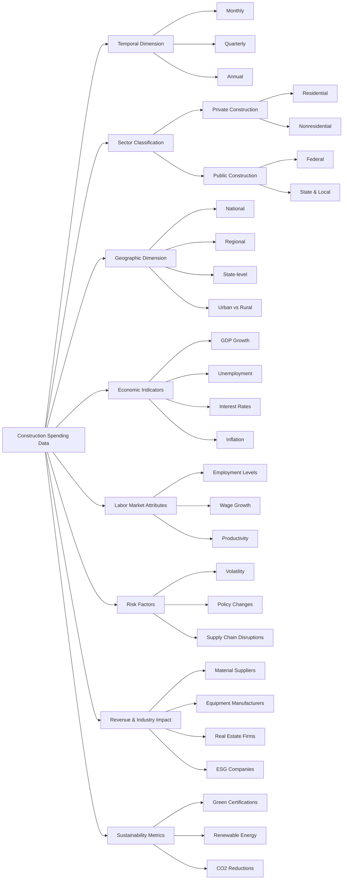

# Ontology #23 - Construction Spend from Census data.                                           
                                 
[The constuction spend data at the US Census website](https://www.census.gov/construction/c30/data/index.html)
---

## 1. Possible Ontology

### **Mermaid Diagram**

Studing the site, this is a possible ontology we can explore:

---

