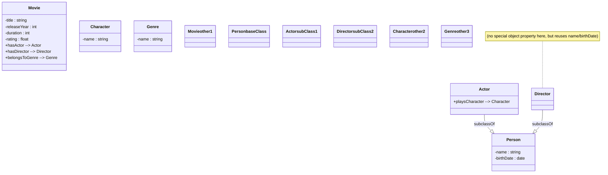

Wishlist for Mermaid rendering in GitHub  

Support for themes. For e.g. this is what I wanted for the Movies ontology:
  

```mermaid                  
classDiagram    
    classDef baseClass fill:#CFF09E    
    classDef subClass1 fill:#A8DBA8    
    classDef subClass2 fill:#79BD9A    
    classDef other1 fill:#FF6B6B    
    classDef other2 fill:#C44D58    
    classDef other3 fill:#C7F464   
    
    class Movie {    
        -title : string    
        -releaseYear : int    
        -duration : int    
        -rating : float    
        +hasActor --> Actor    
        +hasDirector --> Director    
        +belongsToGenre --> Genre    
    }    
        
    class Person {    
        -name : string    
        -birthDate : date    
    }    
        
    class Actor {    
        +playsCharacter --> Character    
    }    
        
    class Director {    
    }    
    note for Director "(no special object property here, but reuses name/birthDate)"    
    
    class Character {    
        -name : string    
    }    
       
    class Genre {    
        -name : string    
    }    
        
    Actor --|> Person : subclassOf    
    Director --|> Person : subclassOf    
    
  class Movie other1    
  class Person baseClass    
  class Actor subClass1    
  class Director subClass2    
  class Character other2    
  class Genre other3      
```     