# Draft Ontology Structure                

```mermaid
classDiagram
    classDef baseClass fill:#CFF09E,stroke:#0B486B
    classDef subClass1 fill:#A8DBA8,stroke:#3B8686
    classDef subClass2 fill:#79BD9A,stroke:#3B8686
    classDef other1 fill:#FF6B6B,stroke:#0B486B
    classDef other2 fill:#C44D58,stroke:#0B486B
    classDef other3 fill:#C7F464,stroke:#0B486B

    class Movie {
        title : string
        releaseYear : int
        duration : int
        rating : float
        hasActor --> Actor
        hasDirector --> Director
        belongsToGenre --> Genre
    }
    note for Movie "Properties (data):\n- title : string\n- releaseYear : integer\n- duration : integer\n- rating : float\nProperties (object):\n- hasActor -> Actor\n- hasDirector -> Director\n- belongsToGenre -> Genre"

    class Person {
        name : string
        birthDate : date
    }
    note for Person "Properties (data):\n- name : string\n- birthDate : date"

    class Actor {
        playsCharacter --> Character
    }
    note for Actor "Properties (object):\n- playsCharacter -> Character"

    class Director {
    }
    note for Director "(no special object property here, but reuses name/birthDate)"

    class Character {
        name : string
    }
    note for Character "Properties (data):\n- name : string"

    class Genre {
        name : string
    }
    note for Genre "Properties (data):\n- name : string"

    Actor --|> Person
    Director --|> Person

  class Movie other1
  class Person baseClass
  class Actor subClass1
  class Director subClass2
  class Character other2
  class Genre other3
```  
                  

      

                
```UML                
Class: Movie                     
   Properties (data):                     
      - title : string                     
      - releaseYear : integer                     
      - duration : integer                     
      - rating : float                     
   Properties (object):                     
      - hasActor -> Actor                     
      - hasDirector -> Director                     
      - belongsToGenre -> Genre                     
                     
Class: Person                     
   Properties (data):                     
      - name : string                     
      - birthDate : date                     
                     
Class: Actor (subclassOf Person)                     
   Properties (object):                     
      - playsCharacter -> Character                     
                     
Class: Director (subclassOf Person)                     
   (no special object property here, but reuses name/birthDate)                     
                     
Class: Character                     
   Properties (data):                     
      - name : string                     
                     
Class: Genre                     
   Properties (data):                     
      - name : string                     
```