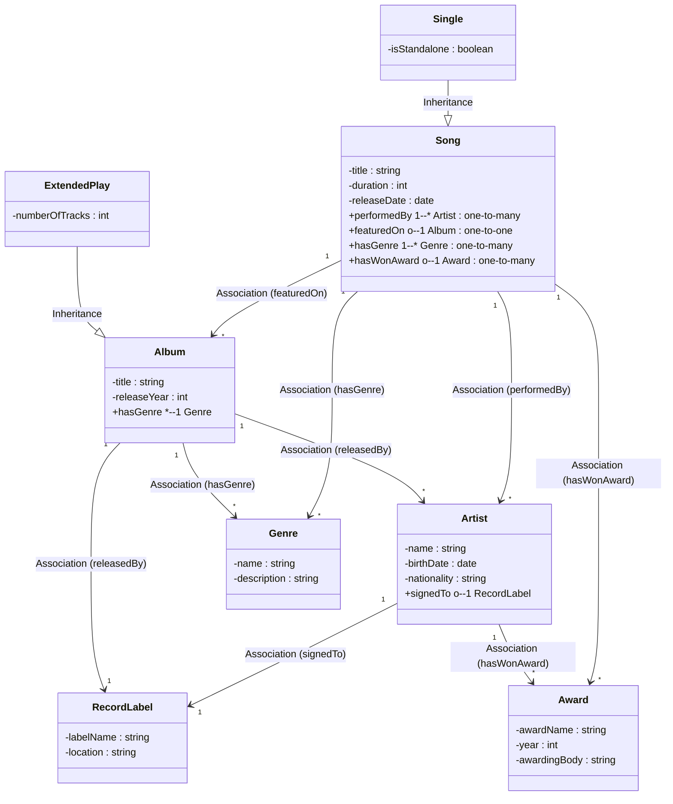

# Ontology #2: Modelling the Music Domain
  

## Competency Questions Approach

**Key idea**: Start by asking, “What do we want our knowledge base to answer?” Then derive your ontology (classes, relationships, attributes) from these questions.  

For example, for the *music domain*, our competency questions could be:  
1. “Which songs are on which album?”  
2. “What is the genre of each album or song?”  
3. “Which artist performed each song?”  
4. “Which artist is signed to which label?”  
5. “When was a given album released?”  
6. “What is the duration of each song?”  
7. “Which songs have won any awards?”  

From these questions, we identify our domain’s classes, properties, and data properties that help us answer them.

---

### Purpose & Scope
A knowledge representation for songs, artists, albums, record labels, awards, and genres, sufficient to answer the competency questions.

### Key Classes (Step Derived from Competency Questions)
- **Song**  
- **Artist**  
- **Album**  
- **RecordLabel**  
- **Genre**  
- **Award**

### Relationships (Object Properties)
- `performedBy` (Song → Artist)  
- `featuredOn` (Song → Album)  
- `hasGenre` (Song → Genre) or (Album → Genre) – we’ll track both so that we can say an album can have a broad genre, and each song can be more specific.  
- `signedTo` (Artist → RecordLabel)  
- `hasWonAward` (Song → Award) – to track if a particular song won any awards.  

*(You could also store awards at the artist level if relevant, but for this example we focus on songs that win awards.)*  

### Data Properties
- **Song**: `title` (string), `duration` (integer in seconds), `releaseDate` (date)  
- **Artist**: `name` (string), `birthDate` (date) – optional for older artists, `nationality` (string)  
- **Album**: `title` (string), `releaseYear` (integer)  
- **RecordLabel**: `labelName` (string), `location` (string)  
- **Genre**: `name` (string), `description` (string) – optional descriptive text  
- **Award**: `awardName` (string), `year` (integer), `awardingBody` (string)
    
---  
    
## Outcome  
The structure of the final ontology is here: [o2-structure.md](https://github.com/shauryashaurya/The-Silmaril/blob/main/o2/o2-structure.md)  
     
The accompanying notebook creates sample data for the ontology for you to import and analyze.
  

---

# Thoughts

We used a different approach (the **Competency Questions** approach) to engineer this Ontology, we did not model the *entire* music domain, but just a subset of the *music business*, based on some questions that we needed answers to.    
    
	