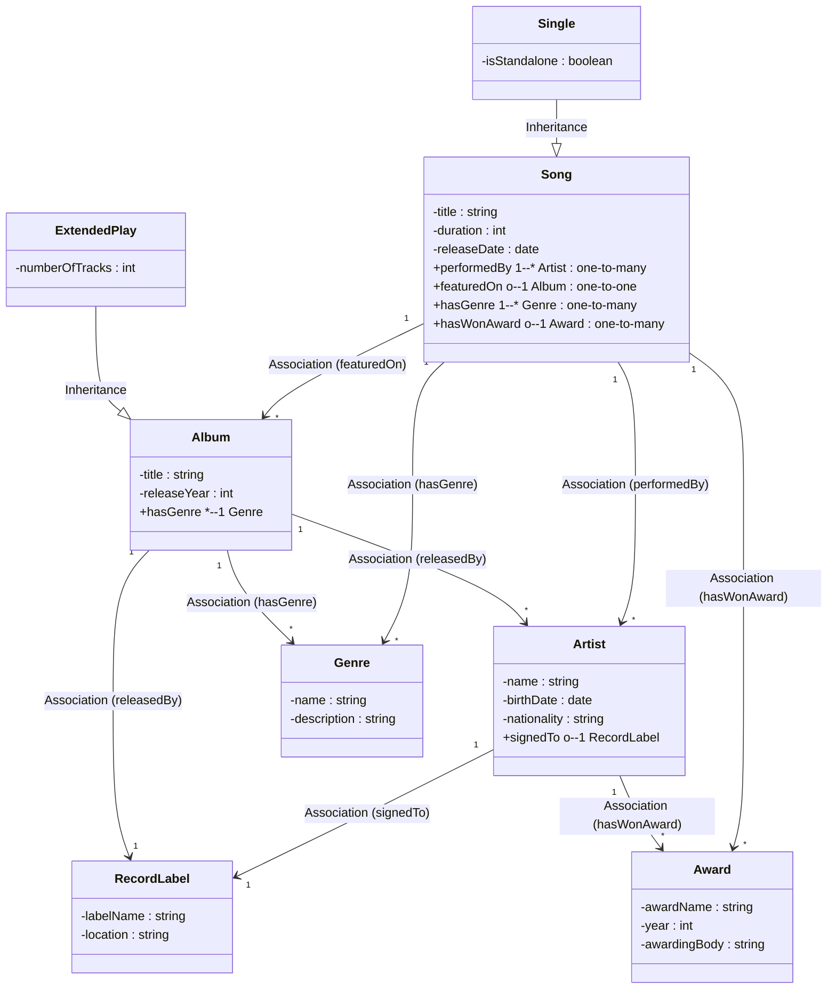

# Ontology Structure                                    
                                      

                                    
---          
          
```pseudocode        
Class: Song        
   - title: string        
   - duration: integer (seconds)        
   - releaseDate: date        
   - performedBy -> Artist (1..*)        
   - featuredOn -> Album (0..1)  // A song typically belongs to one album, though singles might have none        
   - hasGenre -> Genre (1..*)    // A song can fit multiple genres (e.g., Rock & Pop)        
   - hasWonAward -> Award (0..*)        
        
Class: Artist        
   - name: string        
   - birthDate: date        
   - nationality: string        
   - signedTo -> RecordLabel (0..1)  // many are unsigned/independent or signed to exactly one label        
        
Class: Album        
   - title: string        
   - releaseYear: integer        
   - hasGenre -> Genre (1..*)        
   - // we can also keep track of songs via the inverse of featuredOn        
        
Class: RecordLabel        
   - labelName: string        
   - location: string        
        
Class: Genre        
   - name: string        
   - description: string        
        
Class: Award        
   - awardName: string        
   - year: integer        
   - awardingBody: string        
```         
          
*(Cardinality can be adjusted. For example, an artist could be signed to multiple labels in different regions, but we’ll keep it simple.)*          
  