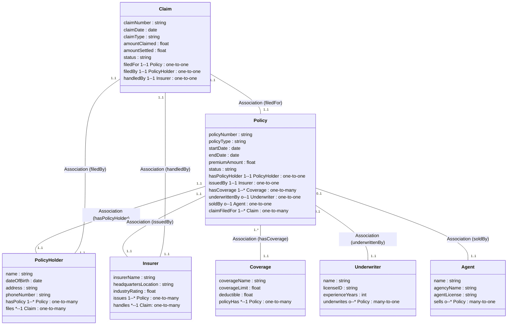

# Ontology Structure                                        
                                          

                                        
---              
              
```pseudocode            
Class: PolicyHolder    
   - name: string    
   - dateOfBirth: date    
   - address: string    
   - phoneNumber: string    
    
Class: Insurer    
   - insurerName: string    
   - headquartersLocation: string    
   - industryRating: float    
    
Class: Underwriter    
   - name: string    
   - licenseID: string    
   - experienceYears: int    
    
Class: Agent (optional)    
   - name: string    
   - agencyName: string    
   - agentLicense: string    
    
Class: Coverage    
   - coverageName: string    
   - coverageLimit: float    
   - deductible: float    
    
Class: Policy    
   - policyNumber: string    
   - policyType: string    
   - startDate: date    
   - endDate: date    
   - premiumAmount: float    
   - status: string    
   - hasPolicyHolder -> PolicyHolder (1..1)    
   - issuedBy -> Insurer (1..1)    
   - hasCoverage -> Coverage (1..*)    
   - underwrittenBy -> Underwriter (0..1)    
   - soldBy -> Agent (0..1) // optional    
    
Class: Claim    
   - claimNumber: string    
   - claimDate: date    
   - claimType: string    
   - amountClaimed: float    
   - amountSettled: float    
   - status: string    
   - filedFor -> Policy (1..1)    
   - filedBy -> PolicyHolder (1..1)    
   - handledBy -> Insurer (1..1)    
        
```             
     