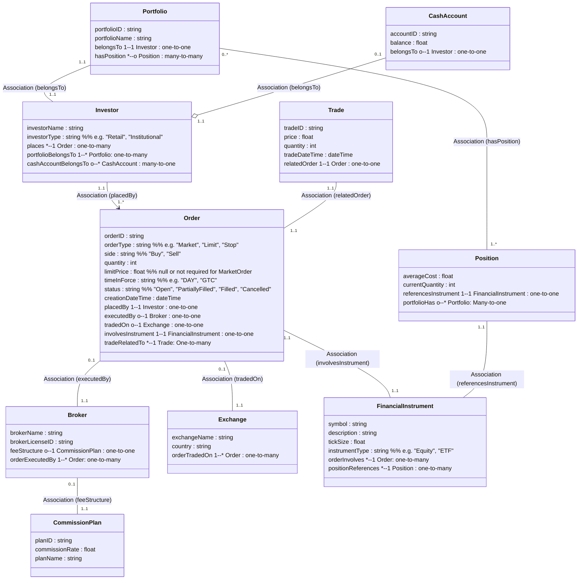

# Ontology #7: Stock Market / Equities Trading 
  
## Ontology Structure                                    
                                         
                                          

                                        
---              
              
```pseudocode            
Class: Investor    
   - investorName: string    
   - investorType: string   // e.g. "Retail", "Institutional"    
   // RULE: An Investor may place Orders and hold Positions in a Portfolio.    
    
Class: Broker    
   - brokerName: string    
   - brokerLicenseID: string    
   - feeStructure -> CommissionPlan (0..1)    
   // RULE: If a Broker is associated with an Order, it means the broker executed/submitted that Order on behalf of an Investor.    
    
Class: CommissionPlan (optional)    
   - planID: string    
   - commissionRate: float    
   - planName: string    
   // RULE: commissionRate should be > 0 and typically < 0.05 (5%) in normal scenarios.    
    
Class: Exchange    
   - exchangeName: string    
   - country: string    
   // RULE: Orders that are "tradedOn" this Exchange have trades executed under that exchange's rules (not deeply enforced here).    
    
Class: FinancialInstrument    
   - symbol: string    
   - description: string    
   - tickSize: float    
   - instrumentType: string // e.g. "Equity", "ETF"    
   // RULE: price increments for trades must be multiples of tickSize in a strict system (we approximate in code).    
    
Class: Order    
   - orderID: string    
   - orderType: string   // e.g. "Market", "Limit", "Stop"    
   - side: string        // "Buy", "Sell"    
   - quantity: int    
   - limitPrice: float   // null or not required for MarketOrder    
   - timeInForce: string // e.g. "DAY", "GTC"    
   - status: string      // "Open", "PartiallyFilled", "Filled", "Cancelled"    
   - creationDateTime: dateTime    
   // RULE 1: If orderType = "Limit", then limitPrice must not be null.    
   // RULE 2: If orderType = "Market", limitPrice must be null.    
   // RULE 3: If status = "Filled", sum of trade quantities for this order = quantity.    
   // RULE 4: If status = "PartiallyFilled", sum of trade quantities < quantity and > 0.    
   // RULE 5: If status = "Open" or "Cancelled", sum of trade quantities = 0 or < quantity.    
    
   // RELATIONSHIPS:    
   - placedBy -> Investor (1..1)    
   - executedBy -> Broker (0..1)  // optional if self-directed    
   - tradedOn -> Exchange (0..1)    
   - involvesInstrument -> FinancialInstrument (1..1)    
    
Class: Trade    
   - tradeID: string    
   - price: float    
   - quantity: int    
   - tradeDateTime: dateTime    
   // RULE: must reference exactly one Order that it partially or fully fills.    
    
   // RELATIONSHIP:    
   - relatedOrder -> Order (1..1)    
    
Class: Portfolio    
   - portfolioID: string    
   - portfolioName: string    
   // RULE: belongs to exactly one Investor.     
   - belongsTo -> Investor (1..1)    
   - hasPosition -> Position (0..*)    
    
Class: Position    
   - averageCost: float    
   - currentQuantity: int    
   // RULE: negative quantity indicates short position, if the system allows short selling.    
    
   // RELATIONSHIP:    
   - referencesInstrument -> FinancialInstrument (1..1)    
    
Class: CashAccount (optional)    
   - accountID: string    
   - balance: float    
   // RULE: belongsTo -> Investor or Broker. If belongsToBroker, might be margin or settlement account.    
    
   // RELATIONSHIP:    
   - belongsTo -> Investor (0..1)    
    
    
```             
              
*(We could add many more details—like quantity, material unit-of-measure, labor hours, etc. We are still in early stages, for this exercise, this may be enough.)*              
  
  